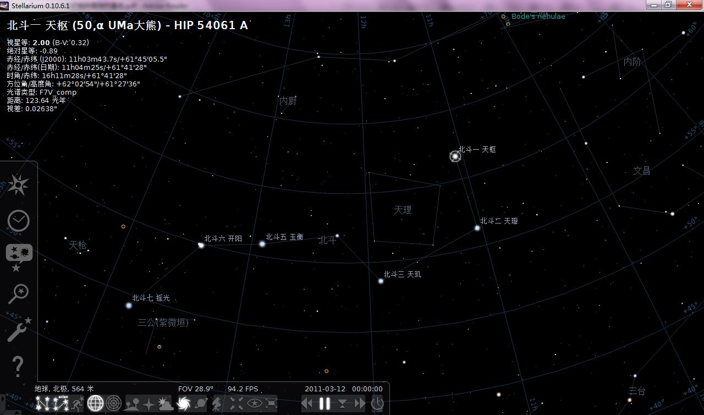
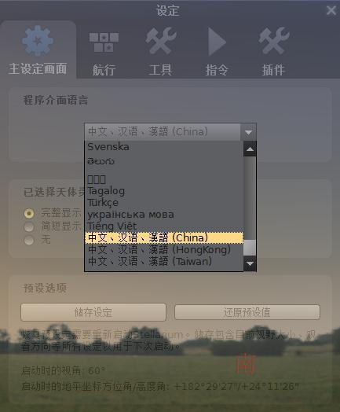
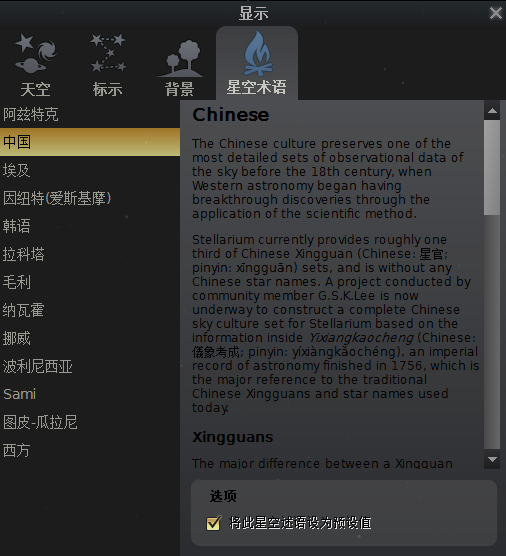
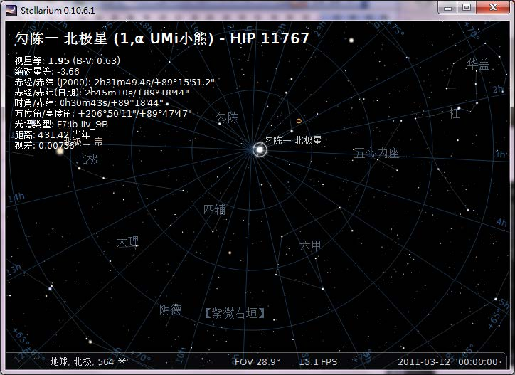
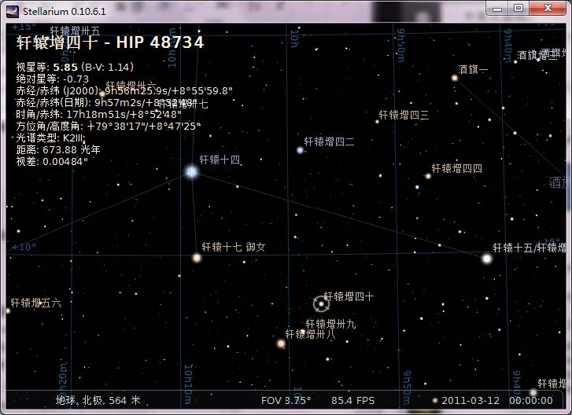
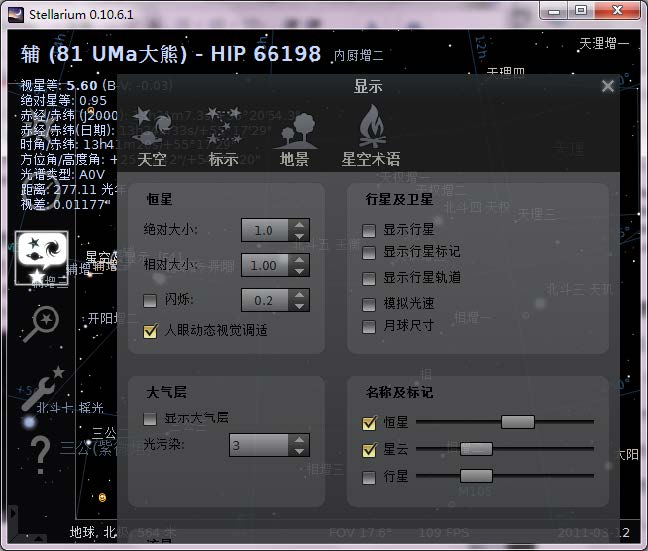
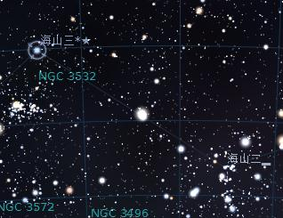
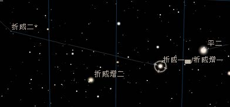

## chinese_cn 刘春滨版中文星名拓展包

## STELLARIUM中文星名扩展包 使用说明

Stellarium 是一款功能强大的电子星图软件，本中文星名扩展包主要依据伊世同《中西对照恒星图表1950.0》整理，将对Stellarium做如下扩充：
- 扩充西文星名：增加数字星名，英文星座名后附加中文名称
- 扩充中文星名：有中文星名的天体数扩充为3247个，远远超过原版数量
- 扩充位置误差：将清代星表中有位置误差的中文星名用符号标示出来

### 1. 将Stellarium调整为中文版

- (1) 在【设定】对话框中将“程序界面语言”调整为“中文”
- (2) 在【显示】对话框中，将“星空术语”调整为“中国”

<table class="layout">
<tr>
    <td></td>
    <td></td>
</tr>
</table>

### 2. 扩充选中恒星的西文名称

<i> 扩充西文星名，星座名有中文 </i>

使用鼠标选中某颗恒星后，界面左上角会显示该恒星的西文名称。通过本操作，可以扩充在第一行显示的恒星西文名称，增加数字星号，并在英文星座名后标注中文。

- 操作：替换文件 Stellarium安装目录/stars/default/name.fab

### 3. 扩充中国古代星名

<i> 扩充原版没有的中文星名 </i>

通过替换软件中的几个星名文件，可以扩充Stellarium的中文星名，显示更多的中国古代星名。

- 操作：替换文件 Stellarium安装目录/stars/default/name.fab
  - Stellarium安装目录/skycultures/chinese/constellationship.fab
  - Stellarium安装目录/skycultures/chinese/constellation_names.eng.fab
  - Stellarium安装目录/skycultures/chinese/star_names.fab

### 4. 显示更多中国古代星名

为了显示所有扩充了的中文星名，可以将【显示】对话框中，“天空-名称及标记-恒星”的滑动条调节为最小，意思是将很暗的恒星的名字也显示出来。

<i> 1. 打开显示对话框 </i>

<i> 2. 调节滑动条 </i>

### 5. 凡例

<b> (1) 中国古代星名位置误差 </b>

《中西对照恒星图表1950.0 》主要依据清代星表《仪象考成》及其续编中所载的恒星位置，经过计算转换为今天国际通用的坐标。转换后有些位置有一定的误差，有些位置则没有对应恒星。这些位置误差信息用中文星名后的符号标示。

<table class="layout">
  <tr>
    <th colspan="2" style="border-top: 1px solid #000; border-left: 1px solid #000; border-right: 1px solid #000; border-bottom: 2px solid #000; padding: 10px; text-align: center; font-size: 1.2em;"><b>凡例</b></th>
  </tr>
  <tr>
    <td style="border-left: 1px solid #000; padding: 8px; text-align: center; width: 20%;">▂</td>
    <td style="border-right: 1px solid #000; padding: 8px;">位置误差小于20'</td>
  </tr>
  <tr>
    <td style="border-left: 1px solid #000; border-bottom: none solid #000; padding: 8px; text-align: center;">▅</td>
    <td style="border-right: 1px solid #000; padding: 8px;">位置误差在20'和40'之间</td>
  </tr>
  <tr>
    <td style="border-left: 1px solid #000; border-bottom: none solid #000; padding: 8px; text-align: center;">█</td>
    <td style="border-right: 1px solid #000; padding: 8px;">位置误差大于40'</td>
  </tr>
  <tr>
    <td style="border-left: 1px solid #000; border-bottom: none solid #000; padding: 8px; text-align: center;">*</td>
    <td style="border-right: 1px solid #000; padding: 8px;">无对照星</td>
  </tr>
  <tr>
    <td style="border-left: 1px solid #000; padding: 8px; text-align: center;">★</td>
    <td style="border-right: 1px solid #000; padding: 8px;">新星、星团、星云</td>
  </tr>
  <tr>
    <td style="border-top: 1px solid #000; border-left: 1px solid #000; border-bottom: 1px solid #000; padding: 8px; text-align: center;">/</td>
    <td style="border-top: 1px solid #000; border-right: 1px solid #000; border-bottom: 1px solid #000; padding: 8px;">星名重复</td>
  </tr>
</table>

<table class="layout">
  <tr><th colspan="2"></th></tr>
  <tr>
    <td>
      <i>海山三*★</i>
      <li>*  表示海山三计算位置没有对应天体，用附近的恒星大概标示其位置。</li>
      <li>★ 表示根据清星表，海山三为新星、星图或者星云（实际上是新星N1843）</li>
    </td>
    <td>
      <i>海山二▂</i>
      <li>▂ 表示海山二此星的位置有&lt;20'的误差</li>
    </td>
  </tr>
</table>

<b> (2) 重复的中国古代星名 </b>

清代星表中所载恒星位置有些有重复，同一位置的恒星有多个名称，这些不同的名称用“/”隔开表示。

<i>折威一▅/折威增一</i>

<li>/ 表示此星有两个名字：折威一和折威增一</li>
<li>▅ 表示折威一的位置经计算后有大于20'小于40'的误差</li>

## 后记

2007年下半年偶然接触了Stellarium，惊鸿一瞥间就被这款软件吸引，由于该软件当时的汉化效果十分差强人意，于是利用业余时间开始在自己的电脑上着手进行中文古代星名的扩充工作，后来又将这个扩充成果上传到了网络上供天文同好共享。鉴于Stellarium中文资料的匮乏，又 开始翻译 Stellarium 的用户使用手册，希望能够让更多的国人领略这款软件的美丽 。一路下来，得到了很多天文同好的支持和帮助，使我终能完成这样一个“大”工程。现将这个工作前后历程记录于后。

<b> 2007年10月，【0.9版汉化包】发布。 </b>

当时，我参考了手头所有资料，完成了中国古代星官所有“正星”和部分“增星”的标注工作。主要参考资料：

## Authors

刘春滨 [liu_chunbin@126.com](mailto:liu_chunbin@126.com)

## License

CC BY-SA 4.0
