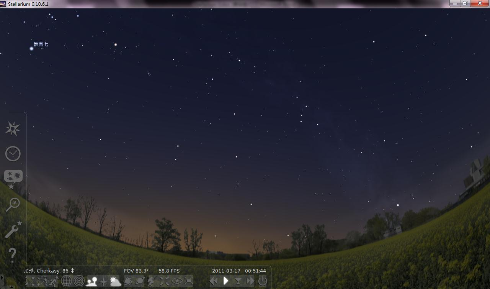
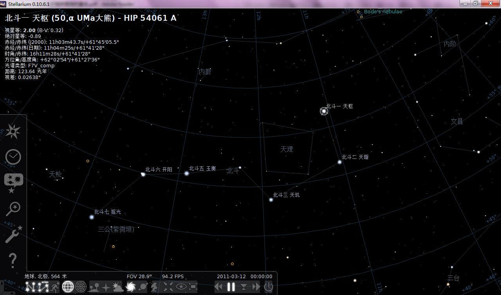
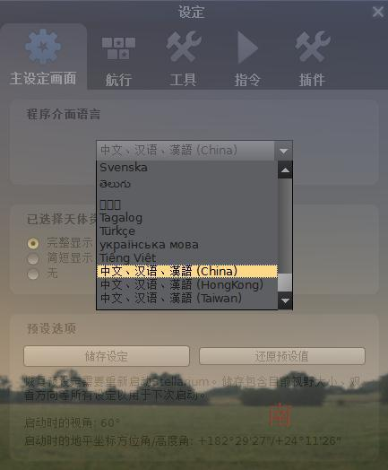
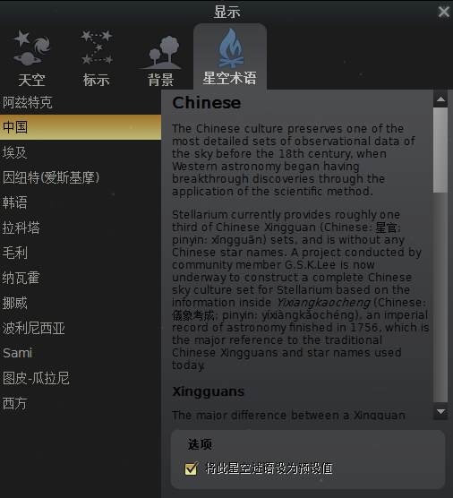
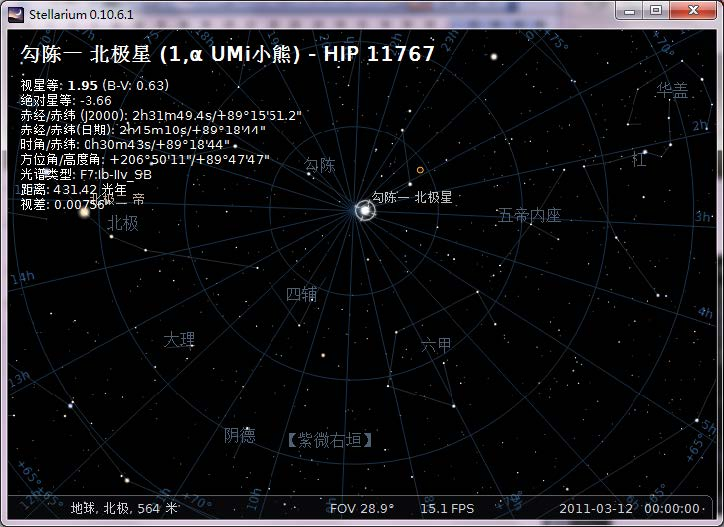
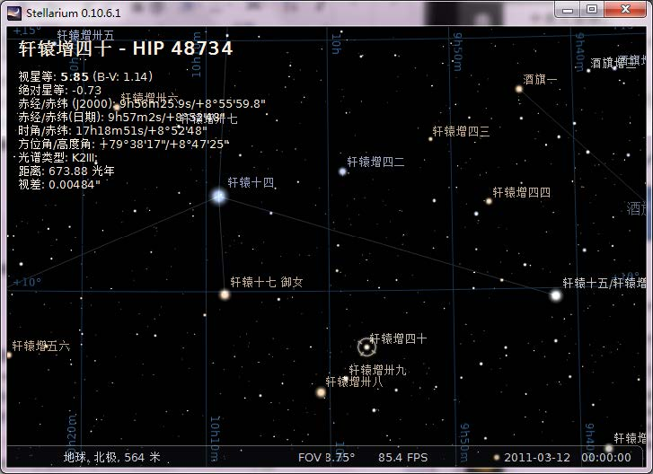
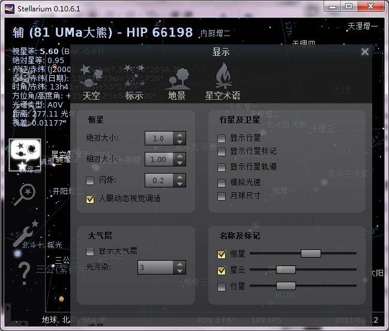
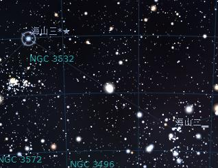
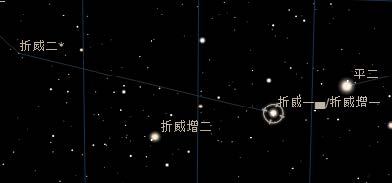
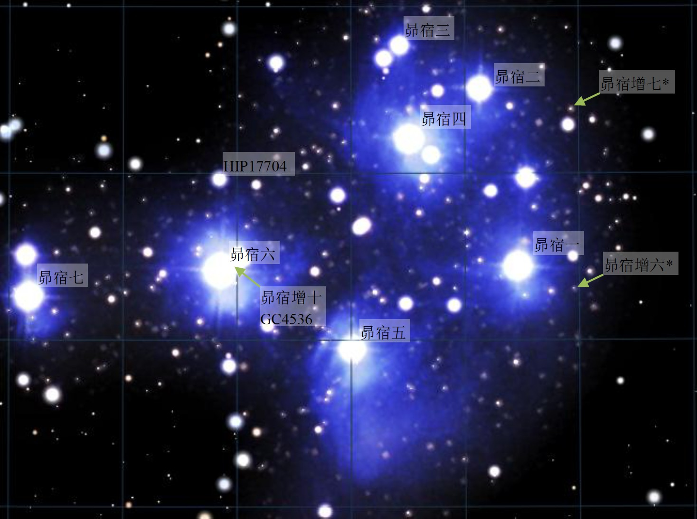

## chinese_cn 刘春滨版中文星名拓展包

## STELLARIUM中文星名扩展包 使用说明

Stellarium 是一款功能强大的电子星图软件，本中文星名扩展包主要依据伊世同《中西对照恒星图表1950.0》整理，将对Stellarium做如下扩充：
- 扩充西文星名：增加数字星名，英文星座名后附加中文名称
- 扩充中文星名：有中文星名的天体数扩充为3247个，远远超过原版数量
- 扩充位置误差：将清代星表中有位置误差的中文星名用符号标示出来

### 1. 将Stellarium调整为中文版

- (1) 在【设定】对话框中将“程序界面语言”调整为“中文”
- (2) 在【显示】对话框中，将“星空术语”调整为“中国”

<table class="layout">
<tr>
    <td></td>
    <td></td>
</tr>
</table>

### 2. 扩充选中恒星的西文名称

<i> 扩充西文星名，星座名有中文 </i>

使用鼠标选中某颗恒星后，界面左上角会显示该恒星的西文名称。通过本操作，可以扩充在第一行显示的恒星西文名称，增加数字星号，并在英文星座名后标注中文。

- 操作：替换文件 Stellarium安装目录/stars/default/name.fab

### 3. 扩充中国古代星名

<i> 扩充原版没有的中文星名 </i>

通过替换软件中的几个星名文件，可以扩充Stellarium的中文星名，显示更多的中国古代星名。

- 操作：替换文件 Stellarium安装目录/stars/default/name.fab
  - Stellarium安装目录/skycultures/chinese/constellationship.fab
  - Stellarium安装目录/skycultures/chinese/constellation_names.eng.fab
  - Stellarium安装目录/skycultures/chinese/star_names.fab

### 4. 显示更多中国古代星名

为了显示所有扩充了的中文星名，可以将【显示】对话框中，“天空-名称及标记-恒星”的滑动条调节为最小，意思是将很暗的恒星的名字也显示出来。

<i> 1. 打开显示对话框 </i>

<i> 2. 调节滑动条 </i>

### 5. 凡例

<b> (1) 中国古代星名位置误差 </b>

《中西对照恒星图表1950.0》主要依据清代星表《仪象考成》及其续编中所载的恒星位置，经过计算转换为今天国际通用的坐标。转换后有些位置有一定的误差，有些位置则没有对应恒星。这些位置误差信息用中文星名后的符号标示。

<table class="layout">
  <tr>
    <th colspan="2" style="border-top: 1px solid #000; border-left: 1px solid #000; border-right: 1px solid #000; border-bottom: 2px solid #000; padding: 10px; text-align: center; font-size: 1.2em;"><b>凡例</b></th>
  </tr>
  <tr>
    <td style="border-left: 1px solid #000; padding: 8px; text-align: center; width: 20%;">▂</td>
    <td style="border-right: 1px solid #000; padding: 8px;">位置误差小于20'</td>
  </tr>
  <tr>
    <td style="border-left: 1px solid #000; border-bottom: none solid #000; padding: 8px; text-align: center;">▅</td>
    <td style="border-right: 1px solid #000; padding: 8px;">位置误差在20'和40'之间</td>
  </tr>
  <tr>
    <td style="border-left: 1px solid #000; border-bottom: none solid #000; padding: 8px; text-align: center;">█</td>
    <td style="border-right: 1px solid #000; padding: 8px;">位置误差大于40'</td>
  </tr>
  <tr>
    <td style="border-left: 1px solid #000; border-bottom: none solid #000; padding: 8px; text-align: center;">*</td>
    <td style="border-right: 1px solid #000; padding: 8px;">无对照星</td>
  </tr>
  <tr>
    <td style="border-left: 1px solid #000; padding: 8px; text-align: center;">★</td>
    <td style="border-right: 1px solid #000; padding: 8px;">新星、星团、星云</td>
  </tr>
  <tr>
    <td style="border-top: 1px solid #000; border-left: 1px solid #000; border-bottom: 1px solid #000; padding: 8px; text-align: center;">/</td>
    <td style="border-top: 1px solid #000; border-right: 1px solid #000; border-bottom: 1px solid #000; padding: 8px;">星名重复</td>
  </tr>
</table>

<table class="layout">
  <tr><th colspan="2"></th></tr>
  <tr>
    <td>
      <i>海山三*★</i>
      <li>*  表示海山三计算位置没有对应天体，用附近的恒星大概标示其位置。</li>
      <li>★ 表示根据清星表，海山三为新星、星图或者星云（实际上是新星N1843）</li>
    </td>
    <td>
      <i>海山二▂</i>
      <li>▂ 表示海山二此星的位置有&lt;20'的误差</li>
    </td>
  </tr>
</table>

<b> (2) 重复的中国古代星名 </b>

清代星表中所载恒星位置有些有重复，同一位置的恒星有多个名称，这些不同的名称用“/”隔开表示。

<i>折威一▅/折威增一</i>

<li>/ 表示此星有两个名字：折威一和折威增一</li>
<li>▅ 表示折威一的位置经计算后有大于20'小于40'的误差</li>

## 后记

2007年下半年偶然接触了Stellarium，惊鸿一瞥间就被这款软件吸引，由于该软件当时的汉化效果十分差强人意，于是利用业余时间开始在自己的电脑上着手进行中文古代星名的扩充工作，后来又将这个扩充成果上传到了网络上供天文同好共享。鉴于Stellarium中文资料的匮乏，又开始翻译Stellarium的用户使用手册，希望能够让更多的国人领略这款软件的美丽。一路下来，得到了很多天文同好的支持和帮助，使我终能完成这样一个“大”工程。现将这个工作前后历程记录于后。

**2007年10月，【0.9版汉化包】发布。**

当时，我参考了手头所有资料，完成了中国古代星官所有“正星”和部分“增星”的标注工作。主要参考资料：

- 互联网上搜集到的古星名资料
- 《全天星图 2000.0》（伊世同 中国地图出版社，1987）
- 《泄露天机 中西星空对话》（陈久金 群言出版社，2005）

此前后得到很多天文同好的支持和帮助，有的来信表示支持、有的来信探讨中国古代星名系统对韩国等邻国的影响、有的反馈测试bug、有的还为扩充文件制作可执行程序……受益良多，恕不一一致谢。

后来Stellarium不断更新版本，特别是升级到0.10版之后，程序界面有了较大变化，汉化也不需要像0.9版那么复杂了。但由于种种原因（可能主要是原来的3个主汉化文件还可以继续使用），我没有对汉化包做什么更新，仅断断续续地补充翻译了《Stellarium 用户使用手册》的附录、帮助网友解决他们在使用中的一些问题、扩充了[Stellarium Wiki的简体中文网站](http://www.stellarium.org/wiki/index.php/首页)。

**2010年8月，【0.9版汉化包更新版】发布。**

此前，**执鸠巡天**来信对0.9版汉化包提出了很多中肯的意见，他还认真核对了每颗恒星的编号。这是几年来第一位对汉化包内容进行校对的天文同好。根据他的校对，我对汉化包进行了一些更正。

**2011年1月，【0.10.6版汉化包】发布。**

2011年1月，有天文同好来信告知Stellarium升级至0.10.6版，原来的汉化文件已经无法使用。遂将0.9版的汉化文件进行了格式的更改后，发布了针对0.10.6版的汉化文件。

**2011年3月，【中文星名扩展包终极版】发布。**

在制作0.10.6版汉化包时，偶然在新浪上发现了《刘夙的网志》，其中连载了很多古代“增星”资料，于是去信联系，竟得到**刘夙**先生无偿的大力帮助，他专门为我复印并邮寄了伊世同先生的《中西对照恒星图表 1950.0（星表分册）》，于是我最终得到了这部梦寐以求的经典。

此次发布的中文星名扩展包终极版收录了《中西对照恒星图表 1950.0》的全部“正星”、“增星”，共计3247颗（比原书增加了一颗南极星），每颗星的位置都根据该书注明的坐标进行了校对。同时还根据该书提供的西名扩充了英文星名文件。

工作中的一些问题做了如下处理：

1.英文星名扩充

根据《中西对照恒星图表 1950.0》所载的西文星名的数字编号对stars/default/name.fab文件进行了扩充，使之可以显示更多的信息。

2.位置误差

根据《中西对照恒星图表 1950.0》标注了所有有位置误差的恒星，用“▂”（位置误差<20'）、“▅”（位置误差在20'和40'之间）和“█”（位置误差>40'）表示。

“*”表示无对照星。主要有2种情况：

一是原书中载明经计算没有对照星的。

二是计算后有对照星，但是Stellarium无法标示的（原因是其使用的HIP星表没有该星的编号）。

以上两种情况都用附近最近的有HIP编号的恒星标注了大致位置，并在星名后加注“*”。第二种情况在skycultures/chinese/star_names.fab文件的对应行中用“#”的方式注释了该星的GC标号（见下方7(2)）。

3.星名重复

《中西对照恒星图表1950.0》依据的清代星表中所载恒星位置有些有重复，即同一位置的恒星有两个甚至两个以上的名称，这些不同的名称用“/”隔开表示。相应重复的第二颗、第三颗星就在skycultures/chinese/star_names.fab文件中用“#”注释掉了，以免Stellarium只显示最后一个星名（见下方7(4)）。

4.新星、星团和星云

有些位置的对照星属于新星、星团、星云或者河外星系等特殊类型的天体，无法用Stellarium使用的HIP标注，我分两种情况进行了处理：

（1）该星官只有此一个天体的，则没有在skycultures/chinese/star_names.fab文件进行标注，而是直接在skycultures/chinese/constellation_names.eng.fab中显示其名称，并在skycultures/chinese/constellationship.fab中显示其位置。这样的好处是可以避免用户认为某颗HIP星就是这个特殊天体。这样情况的星官有：

<table>
<tr><td>神宫</td><td>疏散星团 NGC6231</td></tr>
<tr><td>鱼</td><td>疏散星团 NGC6475/M7</td></tr>
<tr><td>积尸</td><td>疏散星团 NGC2632/M44</td></tr>
</table>

（2）该天体属某星官中的一员，则使用附近最近的有HIP编号的恒星标注了大致位置，并在星名后加注“★”。这样的情况有：

<table>
<tr><td>宋增一</td><td>天市左垣 新星N1848</td></tr>
<tr><td>库楼增一</td><td>球状星团 NGC5139/ω Cen</td></tr>
<tr><td>左旗增九</td><td>新星 N1670/CK Vul</td></tr>
<tr><td>奎宿增廿一</td><td>河外星系 NGC224/M31(仙女座大星云)</td></tr>
<tr><td>海山三</td><td>新星 N1843</td></tr>
</table>

5.单星星官名称的标注

为保持屏幕显示整洁，对于只有一颗星的星官，仅显示恒星名称，不再显示星官名称。这样的恒星有：

<table>
<tr><td>北落师门</td><td>候</td><td>糠</td><td>屎</td><td>天皇大帝</td><td>玄戈</td></tr>
<tr><td>策</td><td>虎贲</td><td>郎将</td><td>太阳守</td><td>天记</td><td>燕</td></tr>
<tr><td>楚</td><td>积尸(胃宿)</td><td>老人</td><td>太乙</td><td>天狼</td><td>野鸡</td></tr>
<tr><td>从官</td><td>积水</td><td>南极</td><td>太子</td><td>天乳</td><td>谒者</td></tr>
<tr><td>大角</td><td>积薪</td><td>农丈人</td><td>太尊</td><td>天乙</td><td>月</td></tr>
<tr><td>帝座</td><td>键闭</td><td>女史</td><td>天阿</td><td>土司空</td><td>越</td></tr>
<tr><td>附路</td><td>进贤</td><td>齐</td><td>天谗</td><td>魏</td><td>招摇</td></tr>
<tr><td>傅说</td><td>晋</td><td>骑阵将军</td><td>天纲</td><td>相</td><td>郑</td></tr>
<tr><td>韩</td><td>军南门</td><td>日</td><td>天关</td><td>幸臣</td><td>柱史</td></tr>
</table>

6.昴宿增星

昴宿共13颗增星，由于昴星团处恒星密度很大，**昴宿增六**和**昴宿增七**二星无法标注，或标注之后相对位置变样，故为了避免不必要的讹误，就没有标注出来。**昴宿增十**（GC4536）使用了最近的HIP17704标示，相对位置也有差异。

兹将昴宿附近放大并标注各星位置如下：

7.注释

扩充文件中，“#”之后的数据Stellarium不会读取（可能以后的版本会有所改变），所以一些补充的注释则使用“#”附加在扩充文件中，供有兴趣的同好参考。注释主要分以下几种：

（1）为保持屏幕显示整洁，不分散用户的注意力，将原来过长的星名进行了简化。主要是当星官重名时，不再在星名中标注所属的重名星官。如“三公一(紫微垣)”简化为“三公一”，同时在行尾用“#”注释“紫微垣”表明其为紫微垣三公一，而不是太微垣三公一。

重名的星官有：

<table>
<tr><td><b>杵</b></td><td>箕宿 危宿</td><td></td><td><b>三公</b></td><td>太微垣 紫微垣</td><td></td><td><b>天田</b></td><td>角宿 牛宿</td></tr>
<tr><td><b>积尸</b></td><td>胃宿 鬼宿</td><td></td><td><b>上卫</b></td><td>紫微右垣 紫微左垣</td><td></td><td><b>五诸侯</b></td><td>井宿 太微垣</td></tr>
<tr><td><b>积水</b></td><td>井宿 胃宿</td><td></td><td><b>少卫</b></td><td>紫微右垣 紫微左垣</td><td></td><td><b>柱</b></td><td>毕宿 角宿</td></tr>
</table>

（2）有对照星，但HIP无编号导致Stellarium无法标注精确位置的星名，在星名中使用“*”表明位置不准确之外，还用“#”注释出其GC编号。

（3）新星、星云、星团等在星名中使用“★”表明其特殊之外，还用“#”注释出天体名称。

（4）在skycultures/chinese/star_names.fab文件中，如果同一HIP编号在多行中出现，则Stellarium只处理最后出现的那一行。所以，使用“#”注释掉了星名重复的第二颗、第三颗星，以免Stellarium只显示最后一个星名。

《中西对照恒星图表 1950.0》是前人中西星名对照研究的集大成者，已经将清代星表《仪象考成》和《仪象考成续编》的所有星位坐标进行了转换计算，所以中国古星名已经全部纳入其中。故此版根据《中西对照恒星图表1950.0》整理的中文星名扩展包，我就称之为终极版了。想来以后不会再对中文星名做扩充了，可能仅仅是根据Stellarium的版本升级，更改一下星名扩充文件的格式。

Stellarium的汉化和中文星名扩充工作算来已经陆陆续续做了四年，今天终于告一断落了。原本准备个人使用的中文星名扩充，最终竟然转化成一个供广大天文同好共享的工程。令人欣慰的是，最后能够用一个比较满意的结果向各位同好做一个谢幕汇报。诸位四年来的关心和帮助，在此一并谢过了。

刘春滨 谨上

2011年3月12日于昆明

[liu_chunbin@126.com](liu_chunbin@126.com)

## Authors

刘春滨 [liu_chunbin@126.com](mailto:liu_chunbin@126.com)

## License

CC BY-SA 4.0
