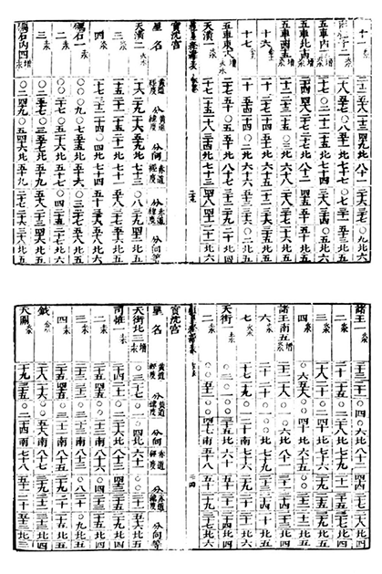
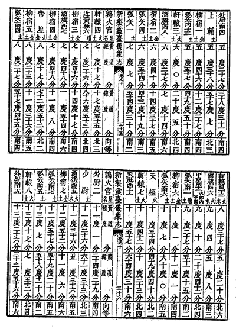

## Chinese_lingtai 中国明末清初

中国明末清初的星象主要来源于明末《崇祯历书》以及清初《灵台仪象志》中的恒星表，两星表中的星象是同一体系，与前世的明代星象以及后世《仪象考成》星象体系都有所不同。

### 《崇祯历书》

自明代中后期开始，陆续有西方传教士入华，他们的目的是传教，但也同时带来了西方的科学，包括历算天文之学，西方近代天文知识和星表、星图在这一时期开始传入中国。明末，徐光启、李之藻等人编修《崇祯历书》时，采用西方先进的原理和方法，提高了历法精度。汤若望、罗雅古等人确立明末的中国星象时，采用了依据西方星表、星图寻找中国对应星，并将西方星表数据加岁差换算，然后进行实测验证的方法，星象收录在《崇祯历书》中的《恒星历指》以及《恒星经纬表》中。

中国传统的283官1464星至明末时已经难以全盘指认了，徐光启对难以辨认的星座或其中部分恒星“旧图所有，而细微隐约者，虽仍其位座，目所未见，星犹阙焉”。具体举例来说，如“旧图中南天田、六甲、天柱、天床等，皆茫昧依稀，不成位座”，又如“器府、天理、八魁、天庙等按图索之，了不可得”，他认为可能是“其近处多有微星，或云昔之作者，弁合此星，缀辑成行，以补苴空缺”。

因此，在《崇祯历书》的星象中，有些星官星数少了，有些星官甚至直接删除，仅保留传统星官1464星中的951星。另一方面，凡“旧图未载，而体势明晰，测量已定，经纬悉具者，一一增入”。在正星的基础上，又增添了相当数目的恒星作为增星，开创了历史先河。

*《崇祯历书》星表*

《崇祯历书》的《恒星经纬表》中，共收录1362星的星名、赤经、赤纬、黄经、黄纬、星等等数据。赤经使用360°制，而非现在的24h，黄经则将360°分为十二宫，以中国传统的十二星次命名。对于星名，《崇祯历书》首次使用了星官+序号的形式。至于增星，则顺延记其序数，星名下添一“增”字，同时大部分增星在星官名与序号间添加方位，用来表示增星位于正星的位置。例如，奎宿有正星十六颗，星名为奎宿一至奎宿十六，后面的增星从“奎宿内十七增”开始，以下依次为“奎宿内十八增”“奎宿内十九增”“奎宿南二十增”“奎宿南二十一增”。

清乾隆年间的《仪象考成》星名也沿用了这种格式，只不过增星序号重新从“一”开始编号，而不是在正星编号后面顺延。《仪象考成》中增星的“增”字放在了方位与序号之间，如“娄宿北增六”“天船南增五”等，也与《崇祯历书》体系不同。

《恒星经纬表》中的恒星坐标数据，基本全部都来源于传教士利玛窦、汤若望等人带入的第谷、开普勒甚至是公元前托勒密的星表数据。第谷星表第一版有777星的数据，此后拓展为1004星，但新增的恒星数据测量工作进行得很匆忙，质量并不高。

到了清代，德国传教士汤若望重新修订增删《崇祯历书》为《西洋新法历书》。（乾隆年间为避讳“弘历”改为《新法算书》，收录入《四库全书》中）不过里面恒星表的部分只对数据有微调，星名星数以及对应星并没有大的变化。

### 灵台仪象志

清康熙年间，比利时传教士南怀仁编著《新制灵台仪象志》，书中对明末星表进行了补充和修正，收录了《崇祯历书》中的全部恒星数据，编入《黄道经纬仪表》和《赤道经纬仪表》中，同时还增加了《增定附各曜之小星黄赤道经纬度表》，星数增加至1877星。赤道表和黄道表均各收录1876星，但赤道表中的天仓南二十在黄道表中并没有出现，黄道表中应也有一星在赤道表中未出现，所以总数为1877星。

《灵台仪象志》星表据记载系通过实测所得，但通过分析数据发现，《黄道经纬仪表》《赤道经纬仪表》中收录的《崇祯历书》数据仍是承传自西方的第谷星表、开普勒星表、托勒密星表等。《增定附各曜之小星黄赤道经纬度表》中的数据通过对比，大部分可能来自拜耳《测天图》，还有一些甚至直接把前文提到的《崇祯历书》星图中用于补位的圈当成恒星收录其中（如云雨三、云雨四就来源于前文图中云雨星官的两个圈，类似的例子还有雷电四五六、天大将军十三等）。

*《灵台仪象志》星表*

### 历史意义

明末清初的星表数据来源繁多，各个来源的精度也各不相同，这导致星表质量参差不齐，但精度的缺陷不能掩盖其历史意义。

《崇祯历书》成书时已是明末，因此这套星象主要应用还是在清朝，清朝直到1744年《仪象考成》之前都是用的《崇祯历书》-《灵台仪象志》星象，这段时间囊括了康乾盛世大部分时间，这一时期的各种天文仪器基本都是使用的《灵台仪象志》，民间的各种星图也都是使用的《灵台仪象志》中的数据（如闵明我《方星图》、梅文鼎《星图》等）。

科技的角度来看，《崇祯历书》星表中首次引入西方星等的概念，并开始使用赤经、赤纬、黄经、黄纬等现代坐标概念，而不再使用传统的入宿度和去极度。星名方面，《崇祯历书》对所有恒星进行了系统编号，奠定了现在的星名格局。在此之前古代观测者都还在使用方位来称呼恒星，比如大陵北星、天囷大星等。《灵台仪象志》星象也对后来的《仪象考成》星象体系有很大影响。

《崇祯历书》依据开普勒星表首次加入了南天恒隐圈中的二十三个星官，由于在中国不可见，这些星官之前从未出现在中国资料中。

清乾隆年间，德国传教士戴进贤主编的《仪象考成》星表在《灵台仪象志》基础上继续完善，数据采用了星数更多、坐标更精确的弗兰斯蒂德星表、赫维留星表和哈雷星表，星数增至3083星，传统星官恢复至277官1319星。虽然星数有所恢复，但星官位置和基本连线框架仍然继承自《灵台仪象志》。

### 作者

观津邀月
