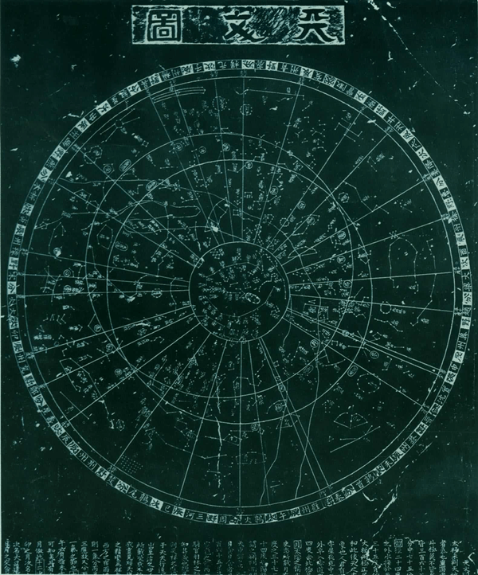
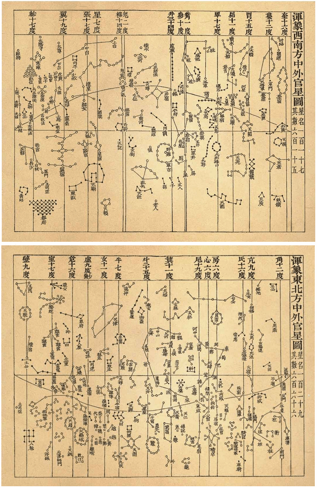

## Chinese_manbu 漫步中国星空

中国天文学是独立发展的，因此也独立发展出了一套星座系统。它在东亚影响深远。在古代，中国的星座和行星的运行和占星术紧密联系在一起。

### 日月和行星

西方依据神话中的神祇人物命名行星。中国古人对五大行星的认识始于五行观念。木为青，火为赤，土为黄，金为白，水为黑。木星呈青色，故称木星；火星呈红色，故称火星；土星为黄色，故称土星；金星为白色，故称金星，水星呈灰色，故以黑色配水星。

在中文里，太阳和太阴则使用阴阳命名。他们的另一个名字属于象形字，分别是日和月。

日月加上五个行星构成七曜，对应了阴阳五行。

### 星官

中国传统天文学将天空分成不同的星群或者星座，称为星官。

其名称和布局非常社会化，地上的王国、山川、百物、百业都搬上天际，按照地上人间的方式在天上复制了一个世界。

中国的星官一般比传统的希腊星座小。宋代的苏州石刻星图有283个星官，1665个星。星官被分成三十一组。二十八宿沿着黄道附近分布，三垣在北方天空。

在明朝以前，中国的星官不包括近南极星区。在明朝末，根据西方星图加入了南天二十三个星官。

和现代的星座指天球的特定区域不同,星官只指恒星的分布方式，相互之间没有具体的边界。

### 传统星名

星官包含的恒星多则几十颗，少则可以只有一颗。有两颗以上恒星组成的星官，每个恒星都有编号。中国古代对恒星的命名就是星官的名字加上一个数字编号。但也有少数星官，每个恒星都有专名。

星官已经很少被使用, 但中国传统星名相比西方星名仍然被更普遍的使用。

*苏州石刻星图(1247年)*

### 三垣

三垣是北天黄道所围区域里的三个大天区。垣里包含着很多星官。三垣分别是紫微垣，太微垣和天市垣。

垣是围墙的意思。垣里包含着很多星官，墙外附近也有相关星官属于该垣。

紫微垣代表了皇家的紫禁城，是天帝起居的地方，大体是北天的拱极星区。这里是天际的中央，所有的星星都环绕它运行。紫微垣有星官37个。
 - [紫微垣的维基百科](https://en.wikipedia.org/wiki/Purple_Forbidden_enclosure)

太微垣是天帝和臣子门处理政物的地方。里面有各种官员和政府机构。太微垣在狮子座，后发座，室女座的位置。太微垣有星官20个。
 - [太微垣的维基百科](https://en.wikipedia.org/wiki/Supreme_Palace_enclosure)

天市垣是天上的市集，是平民百姓居住的地方。大致相当于武仙、巨蛇、蛇夫等星座的一部分。天市垣有星官19个，以市场的设施和参与者命名。
 - [天市垣的维基百科](https://en.wikipedia.org/wiki/Heavenly_Market_enclosure)

### 二十八宿

二十八宿是古代中国将黄道和天赤道附近的天区按照赤经划分为二十八个区域。每个区域称为宿。月行一日大致为一宿。

每一个宿在黄道附近有一个同名的星官，为宿星。凡落在宿这个区域的星官，便属于该宿统辖。

二十八宿的每宿中作为测量赤经相对标志的恒星称为该宿的距星。本宿距星和下一距星之间的在赤经上的差值为本宿的宿度。中国古代的传统坐标系以日行一日为一度，周天共三百六十五又四分之一度，为一个回归年。

二十八宿又按照东南西北分成四象，每组七宿，分别对应七曜。

### 二十八宿列表(J2000)
|    |  |   |   |   |   |   |   |   |
|----|--|---|---|---|---|---|---|---|
| 七耀 |  | 木 | 金 | 土 | 日 | 月 | 火 | 水 |
| 中名 | 东方苍龙 | 角宿 | 亢宿 | 氐宿 | 房宿 | 心宿 | 尾宿 | 箕宿 |
| 拼音 | dōng fāng cāng lóng | jiǎo xiù | kàng xiù | dī xiù | fáng xiù | xīn xiù | wěi xiù | jī xiù |
| 英译 | Azure Dragon of the East | Horn Mansion | Neck Mansion | Root Mansion | Room Mansion | Heart Mansion | Tail Mansion | Winnowing Basket Mansion |
| 星官数 | 47 | 11 | 7 | 11 | 7 | 2 | 6 | 3 |
| 距星 |  | 角宿一,α Vir | 亢宿一,κ Vir | 氐宿一,α2 Lib | 房宿一,π Sco | 心宿一,σ Sco | 尾宿一,μ1 Sco | 箕宿一,γ Sgr |
| 距星赤经 |  | 13h26m07.80s | 14h13m50.66s | 14h51m51.79s | 15h59m55.74s | 16h22m16.18s | 16h53m04.53s | 18h06m56.68s |
| 宿度1 |  | 47m42s | 37m59s | 1h07m58s | 22m20s | 30m41s | 1h13m57s | 39m51s |
| 宿度2 |  | 12.10° | 9.63° | 17.24° | 5.67° | 7.78° | 18.76° | 10.11° |
| 中名 | 北方玄武 | 斗宿 | 牛宿 | 女宿 | 虚宿 | 危宿 | 室宿 | 壁宿 |
| 拼音 | běi fāng xuán wǔ | dǒu xiù | niú xiù | nǚ xiù | xū xiù | wēi xiù | shì xiù | bì xiù |
| 英译 | Black Tortoise of the North | Dipper Mansion | Ox Mansion | Girl Mansion | Emptiness Mansion | Rooftop Mansion | Encampment Mansion | Wall Mansion |
| 星官数 | 65 | 10 | 11 | 8 | 10 | 10 | 10 | 6 |
| 距星 |  | 斗宿一,φ Sgr | 牛宿一,β Cap | 女宿一,ε Aqr | 虚宿一,β Aqr | 危宿一,α Aqr | 室宿一 α Peg | 壁宿一,γ Peg |
| 距星赤经 |  | 18h46m45.65s | 20h22m00.18s | 20h48m37.92s | 21h32m29.34s | 22h06m41.57s | 23h05m38.77s | 00h14m09.14s |
| 宿度1 |  | 1h35m21s | 26m40s | 43m53s | 34m13s | 58m59s | 1h08s29s | 34m06s |
| 宿度2 |  | 24.19° | 6.76° | 11.13° | 8.68 | 14.96° | 17.37° | 8.65° |
| 中名 | 西方白虎 | 奎宿 | 娄宿 | 胃宿 | 昴宿 | 毕宿 | 觜宿 | 参宿 |
| 拼音 | xī fāng bái hǔ | kuí xiù | loú xiù | wèi xiù | mǎo xiù | bì xiù | zī xiù | shēn xiù |
| 英译 | White Tiger of the West | Legs Mansion | Bond Mansion | Stomach Mansion | Hairy Head Mansion | Net Mansion | Turtle Beak Mansion | Three Stars Mansion |
| 星官数 | 54 | 9 | 6 | 7 | 9 | 14 | 3 | 6 |
| 距星 |  | 奎宿一,ζ And | 娄宿一,β Ari | 胃宿一,35 Ari | 昴宿一,17 Tau | 毕宿一,ε Tau | 觜宿一,φ1 Ori | 参宿一,δ Ori |
| 距星赤经 |  | 00h48m17.15s | 01h55m37.47s | 02h44m29.96s | 03h45m55.96s | 04h29m39.26s | 05h35m47.64s | 05h32m54.74s |
| 宿度1 |  | 1h07m18s | 48m49s | 1h01m26s | 43m44s | 1h06m31s | 5m32s | 42m12s |
| 宿度2 |  | 17.07° | 12.38° | 15.58° | 11.09° | 16.87° | 1.40° | 10.70° |
| 中名 | 南方朱雀 | 井宿 | 鬼宿 | 柳宿 | 星宿 | 张宿 | 翼宿 | 轸宿 |
| 拼音 | nán fāng zhū què | jǐng xiù | guǐ xiù | liǔ xiù | xīng xiù | zhāng xiù | yì xiù | zhěn xiù |
| 英译 | Vermilion Bird of the South | Well Mansion | Ghosts Mansion | Willow Mansion | Star Mansion | Extended Net Mansion | Wings Mansion | Chariot Mansion |
| 星官数 | 42 | 19 | 7 | 2 | 5 | 2 | 2 | 5 |
| 距星 |  | 井宿一,μ Gem | 鬼宿一,θ Cnc | 柳宿一,δ Hya | 星宿一,α Hya | 张宿一,υ1 Hya | 翼宿一,α Crt | 轸宿一,γ Crv |
| 距星赤经 |  | 06h24m01.87s | 08h32m36.08s | 08h38m35.52s | 09h28m27.52s | 09h52m19.96s | 11h00m38.50s | 12h16m43.43s |
| 宿度1 |  | 2h08m38s | 6m3s | 49m58s | 23m54s | 1h08m17s | 1h16m02s | 1h09m23s |
| 宿度2 |  | 32.63° | 1.54° | 12.67° | 6.06° | 17.32° | 19.29° | 17.60° |

注1.宿度1 现代赤道坐标系赤经。

注2.宿度2 中国传统坐标系赤经，以周天365.25度计。
 - [二十八宿的维基百科](https://en.wikipedia.org/wiki/Twenty-Eight_Mansions)

### 近南极星区

近南极星区对古中国来说是未知的，所以不包括在三垣二十八宿内。明朝末年，徐光启根据西方星表加上近南极星区的星官二十三个。这些星官因此纳入了中国传统星图。这些星官其实是西方星座的变异，多以动物命名。

### 星官列表
|    |    |    |     |     |
|----|----|----|-----|-----|
| 星官 | 拼音 | 英译 | 正星数 | 增星数 |
| 紫微垣 | zǐ wēi yuán | Purple Forbidden Enclosure |  |  |
| 北极 | běi jí | Northern Pole | 5 | 4+3+6+19+1=33 |
| 四辅 | sì fǔ | Four Advisors | 4 | 47 |
| 天一 | tiān yī | Celestial Great One | 1 | 0 |
| 太一 | tài yī | First Great One | 1 | 3 |
| 紫微左垣 | Zǐwēi Zuǒyuán | Purple Forbidden Left Wall | 8 | 12 |
| 紫微右垣 | Zǐwēi Yòuyuán | Purple Forbidden Right Wall | 7 | 12 |
| 阴德 | Yīndé | Hidden Virtue | 2 | 1 |
| 尚书 | Shàngshū | Royal Secretary | 5 | 2 |
| 女史 | Nǚshǐ | Female Protocol | 1 | 1 |
| 柱史 | Zhùshǐ | Official of Royal Archives | 1 | 2 |
| 御女 | Yùnǚ | Maids-in-waiting | 4 | 1 |
| 天柱 | Tiānzhù | Celestial Pillar | 5 | 6 |
| 大理 | Dàlǐ | Chief Judge | 2 | 1 |
| 勾陈 | Gōuchén | Curved Array | 6 | 10 |
| 六甲 | Liùjiǎ | Six Jia | 6 | 1 |
| 天皇大帝 | Tiānhuángdàdì | Great Emperor of Heaven | 1 | 0 |
| 五帝内座 | Wǔdì NèiZuò | Interior Seats of the Five Emperors | 5 | 3 |
| 华盖 | Huágài | Canopy of the Emperor | 7 | 0 |
| 杠（附华盖） | Gàng | Canopy Support(Vassal of Canopy of the Emperor ) | 9 | 1 |
| 传舍 | Zhuànshè | Guest House | 9 | 4 |
| 内阶 | Nèijiē | Inner Steps | 6 | 10 |
| 天厨 | Tiānchú | Celestial Kitchen | 6 | 2 |
| 八谷 | Bāgǔ | Eight Kinds of Crops | 8 | 34 |
| 天棓 | Tiānbàng | Celestial Flail | 5 | 10 |
| 内厨 | Nèichú | Inner Kitchen | 2 | 2 |
| 文昌 | Wénchāng | Administrative Center | 6 | 8 |
| 三师 | Sānshī | Three Top Instructors | 3 | 1 |
| 三公 | Sāngōng | Three Excellencies | 3 | 0 |
| 天床 | Tiānchuáng | Celestial Bed | 6 | 2 |
| 太尊 | Tiānláo | Royals | 1 | 0 |
| 天牢 | Tàizūn | Celestial Prison | 6 | 2 |
| 太阳守 | Tàiyángshǒu | Guard of the Sun | 1 | 1 |
| 势 | Shì | Eunuch | 4 | 19 |
| 相 | Xiàng | Prime Minister | 1 | 3 |
| 玄戈 | Xuángē | Sombre Lance | 1 | 2 |
| 天理 | Tiānlǐ | Judge for Nobility | 4 | 1 |
| 北斗 | Běidǒu | Northern Dipper | 7 | 16 |
| 辅（附北斗） | Fǔ | Assistant(Vassal of Northern Dipper) | 1 | 3 |
| 天枪 | Tiānqiāng | Celestial Spear | 3 | 4 |
| 太微垣 | Tàiwēiyuán | Supreme Palace Enclosure |  |  |
| 太微左垣 | Tàiwēi Zuǒyuán | Supreme Palace Left Wall | 5 | 9 |
| 太微右垣 | Tàiwēi Yòuyuán | Supreme Palace Right Wall | 5 | 5 |
| 谒者 | Yézhě | Usher to the Court | 1 | 2 |
| 三公 | Sāngōng | Three Excellencies | 3 | 0 |
| 九卿 | Jiǔqīng | Nine Senior Officers | 3 | 9 |
| 五诸侯 | Wǔ Zhūhóu | Five Lords | 5 | 7 |
| 内屏 | Nèipíng | Inner Screen | 4 | 6 |
| 五帝座 | Wǔdì Zuò | Seats of the Five Emperors | 5 | 4 |
| 幸臣 | Xìngchén | Officer of Honour | 1 | 0 |
| 太子 | Tàizǐ | Crown Prince | 1 | 0 |
| 从官 | Cóngguān | Retinue | 1 | 0 |
| 郎将 | Lángjiàng | Captain of the Bodyguards | 1 | 2 |
| 虎贲 | Yézhě | Emperor's Bodyguard | 1 | 0 |
| 常陈 | Chángchén | Royal Guards | 7 | 7 |
| 郎位 | Lángwèi | Officers of the Imperial Guard | 15 | 3 |
| 明堂 | Míngtáng | The Hall of Glory | 3 | 7 |
| 灵台 | Língtaí | Astronomical Observatory | 3 | 8 |
| 少微 | Shàowēi | Junior Officers | 4 | 9 |
| 长垣 | Chángyuán | Long Wall | 4 | 9 |
| 三台 | Sāntái | Three Steps | 6 | 13 |
| 天市垣 | Tiānshìyuán | Heavenly Market Enclosure |  |  |
| 天市左垣 | Tiānshì Zuǒyuán | Heavenly Market Left Wall | 11 | 48 |
| 天市右垣 | Tiānshì Yòuyuán | Heavenly Market Right Wall | 11 | 32 |
| 市楼 | Shìlóu | Municipal Office | 6 | 1 |
| 车肆 | Chēsì | Commodity Market | 2 | 2 |
| 宗正 | Zōngzhèng | Official for the Royal Clan | 2 | 3 |
| 宗人 | Zōngrén | Official of Religious Ceremonies | 4 | 4 |
| 宗 | Zōng | Patriarchal Clan | 2 | 0 |
| 帛度 | Bódù | Textile Ruler | 2 | 3 |
| 屠肆 | Túsì | Butcher's Shops | 2 | 3 |
| 候 | Hòu | Astrologer | 1 | 6 |
| 帝座 | Dì zuò | Emperor's Seat | 1 | 0 |
| 宦者 | Huàngzhě | Eunuch Official | 4 | 5 |
| 列肆 | Lièsì | Jewel Market | 2 | 4 |
| 斗 | Dǒu | Dipper for Liquids | 5 | 11 |
| 斛 | Hú | Dipper for Solids | 4 | 7 |
| 贯索 | Guànsuǒ | Coiled Thong | 9 | 13 |
| 七公 | Qīgōng | Seven Excellencies | 7 | 16 |
| 天纪 | Tiānjì | Celestial Discipline | 9 | 15 |
| 女床 | Nǚchuáng | Woman's Bed | 3 | 0 |
| 角宿 | jiǎo xiù | Horn Mansion |  |  |
| 角 | jiǎo | Horn | 2 | 33 |
| 平道 | píng dào | Flat Road | 2 | 4 |
| 天田 | tiān tián | Celestial Farmland | 2 | 25 |
| 进贤 | jìn xián | Recommending Virtuous Men | 1 | 34 |
| 周鼎 | zhōu dǐng | Tripod of the Zhou | 3 | 49 |
| 天门 | tiān mén | Celestial Gate | 2 | 20 |
| 平星 | píng xīng | Justice | 2 | 31 |
| 库楼 | kù lóu | Arsenal | 10 | 102 |
| 柱 | zhù | Pillars | 15 | 65 |
| 衡 | héng | Railings | 4 | 4 |
| 南门 | nán mén | Southern Gate | 2 | 86 |
| 亢宿 | kàng xiù | Neck Mansion |  |  |
| 亢 | kàng | Neck | 4 | 61 |
| 大角 | dà jiǎo | Great Horn | 1 | 14 |
| 折威 | zhé wēi | Executions | 7 | 19 |
| 左摄提 | zuǒ shè tí | Left Conductor | 3 | 9 |
| 右摄提 | yòu shè tí | Right Conductor | 3 | 6 |
| 顿顽 | dùn wán | Trials | 2 | 8 |
| 阳门 | yáng mén | Gate of Yang | 2 | 21 |
| 氐宿 | dī xiù | Root Mansion |  |  |
| 氐 | dī | Root | 4 | 110 |
| 天乳 | tiān rǔ | Celestial Milk | 1 | 15 |
| 招摇 | zhāo yáo | Twinkling Indicator | 1 | 22 |
| 梗河 | gěng hé | Celestial Lance | 3 | 14 |
| 帝席 | dì xí | Mattress of the Emperor | 3 | 14 |
| 亢池 | kàng chí | Boats and Lake | 6 | 5 |
| 骑官 | qí guān | Imperial Guards | 27 | 118 |
| 阵车 | zhèn chē | Battle Chariots | 3 | 13 |
| 车骑 | chē qí | Chariots and Cavalry | 3 | 32 |
| 天辐 | tiān fú | Celestial Spokes | 2 | 19 |
| 骑阵将军 | qí zhèn jiāng jūn | Chariots and Cavalry General | 1 | 2 |
| 房宿 | fáng xiù | Room Mansion |  |  |
| 房 | fáng | Room | 4 | 28 |
| 钩钤（附房宿） | gōu qián | Lock(Vassal of Room) | 2 | 4 |
| 键闭 | jiàn bì | Door Bolt | 1 | 8 |
| 罚 | fá | Punishment | 3 | 2 |
| 东咸 | dōng xián | Eastern Door | 4 | 18 |
| 西咸 | xī xián | Western Door | 4 | 18 |
| 日 | rì | Solar Star | 1 | 15 |
| 从官 | cóng guān | Retinue | 2 | 19 |
| 心宿 | xīn xiù | Heart Mansion |  |  |
| 心 | xīn | Heart | 3 | 15 |
| 积卒 | jī zú | Group of Soldiers | 2 | 81 |
| 尾宿 | Wěixiù | Tail Mansion |  |  |
| 尾宿 | Wěixiù | Tail | 9 | 4 |
| 神宫(附尾宿) | shéngōng | Changing Room(Vassal of Tail) | 1 | 0 |
| 龟 | Guī | ortoise | 5 | 0 |
| 天江 | Tiānjiāng | Celestial River | 4 | 11 |
| 傅说 | Fù Yuè | Fu Yue | 1 | 0 |
| 鱼 | Yú | Fish | 1 | 0 |
| 箕宿 | Jīxiù | Winnowing Basket Mansion |  |  |
| 箕宿 | Jīxiù | Winnowing Basket | 4 | 0 |
| 糠 | Kāng | Chaff | 1 | 1 |
| 杵 | Chǔ | Pestle | 3 | 1 |
| 斗宿 | Dǒuxiù | Dipper Mansion |  |  |
| 斗宿 | Dǒuxiù | Dipper | 6 | 5 |
| 建 | Jiàn | Establishment | 6 | 10 |
| 天籥 | Tiānyuè | Celestial Keyhole | 8 | 4 |
| 天弁 | Tiānbiàn | Market Officer | 9 | 6 |
| 鳖 | Biē | River Turtle | 11 | 0 |
| 天鸡 | Tiānjī | Celestial Cock | 2 | 3 |
| 狗国 | Gǒuguó | Territory of Dog | 4 | 3 |
| 天渊 | Tiānyuān | Celestial Spring | 3 | 3 |
| 狗 | Gǒu | Dog | 2 | 7 |
| 农丈人 | Nóngzhàngrén | Peasant | 1 | 0 |
| 牛宿 | Niúxiù | Ox Mansion |  |  |
| 牛宿 | Niúxiù | Ox | 6 | 14 |
| 天田 | Tiāntián | Celestial Farmland | 4 | 0 |
| 九坎 | Jiǔkǎn | Nine Water Wells | 4 | 0 |
| 河鼓 | Hégǔ | Drum at the River | 3 | 9 |
| 织女 | Zhinǚ | Weaving Girl | 3 | 4 |
| 左旗 | Zuǒqí | Left Flag | 9 | 30 |
| 右旗 | Yòuqí | Right Flag | 9 | 12 |
| 天桴 | Tiānfú | Celestial Drumstick | 4 | 2 |
| 罗堰 | Luóyàn | Network of Dykes | 3 | 1 |
| 渐台 | Jiàntái | Clepsydra Terrace | 4 | 7 |
| 辇道 | Niǎndào | Imperial Passageway | 5 | 9 |
| 女宿 | Nǚxiù | Girl Mansion |  |  |
| 女宿 | Nǚxiù | Girl | 4 | 5 |
| 十二国 | Shíèrguó | Twelve States | 16 | 2 |
| 离珠 | Lízhū | Pearls on Ladies' Wear | 4 | 1 |
| 败瓜 | Bàiguā | Rotten Gourd | 5 | 3 |
| 瓠瓜 | Hùguā | Good Gourd | 5 | 8 |
| 天津 | Tiānjīn | Celestial Ford | 9 | 40 |
| 奚仲 | Xī Zhòng | Xi Zhong | 4 | 7 |
| 扶筐 | Fúkuāng | Basket for Mulberry Leaves | 7 | 4 |
| 虚宿 | Xūxiù | Emptiness Mansion |  |  |
| 虚宿 | Xūxiù | Emptiness | 2 | 8 |
| 司命 | Sīmìng | Deified Judge of Life | 2 | 0 |
| 司禄 | Sīlù | Deified Judge of Rank | 2 | 0 |
| 司危 | Sīwēi | Deified Judge of Disaster and Good Fortune | 2 | 0 |
| 司非 | Sīfēi | Deified Judge of Right and Wrong | 2 | 3 |
| 哭 | Kū | Crying | 2 | 4 |
| 泣 | Qì | Weeping | 2 | 2 |
| 天垒城 | Tiānlěichéng | Celestial Ramparts | 13 | 2 |
| 败臼 | Bàijiù | Decayed Mortar | 4 | 1 |
| 离瑜 | Líyù | Jade Ornament on Ladies' Wear | 3 | 3 |
| 危宿 | Wēixiù | Rooftop Mansion |  |  |
| 危宿 | Wēixiù | Rooftop | 3 | 14 |
| 坟墓（附危宿） | Fénmù | Tomb(Vassal of Rooftop) | 4 | 4 |
| 人 | Rén | Humans | 4 | 4 |
| 杵 | Chǔ | Pestle | 3 | 2 |
| 臼 | Jiù | Mortar | 4 | 8 |
| 车府 | Chēfǔ | Big Yard for Chariots | 7 | 20 |
| 天钩 | Tiāngōu | Celestial Hook | 9 | 18 |
| 造父 | Zàofǔ | Zaofu | 5 | 5 |
| 盖屋 | Gàiwū | Roofing | 2 | 0 |
| 虚梁 | Xūliáng | Temple | 4 | 0 |
| 天钱 | Tiānqián | Celestial Money | 5 | 3 |
| 室宿 | Shìxiù | Encampment Mansion |  |  |
| 室宿 | Shìxiù | Encampment | 2 | 7 |
| 离宫（附室宿） | Lígōng | Resting Palace(Vassal of Encampment) | 6 | 8 |
| 雷电 | Léidiàn | Thunder and Lightning | 6 | 8 |
| 垒壁阵 | Lěibìzhèn | Line of Ramparts | 12 | 8 |
| 羽林军 | Yǔlínjūn | Palace Guard | 45 | 0 |
| 𫓧钺 | Fūyuè | Axe | 3 | 3 |
| 北落师门 | Běiluò Shīmén | North Gate of the Military Camp | 1 | 0 |
| 八魁 | Bākuí | Net for Catching Birds | 6 | 0 |
| 天纲 | Tiāngāng | Materials for Making Tents | 1 | 0 |
| 土公吏 | Tǔgōnglì | Official for Materials Supply | 2 | 0 |
| 螣蛇 | Téngshé | Flying Serpent | 22 | 19 |
| 壁宿 | Bìxiù | Wall Mansion |  |  |
| 壁宿 | Bìxiù | Wall | 2 | 23 |
| 霹雳 | Pīlì | Thunderbolt | 5 | 9 |
| 云雨 | Yúnyǔ | Cloud and Rain | 4 | 10 |
| 天厩 | Tiānjiù | Celestial Stable | 3 | 1 |
| 𫓧锧 | Fūzhì | Sickle | 5 | 0 |
| 土公 | Tǔgōng | Official for Earthworks and Buildings | 2 | 11 |
| 奎宿 | Kuíxiù | Legs Mansion |  |  |
| 奎宿 | Kuíxiù | Legs | 16 | 23 |
| 外屏 | Wàipíng | Outer Fence | 7 | 15 |
| 天溷 | Tiānhùn | Celestial Pigsty | 4 | 6 |
| 土司空 | Tǔsīkōng | Master of Constructions | 1 | 0 |
| 军南门 | Nánjūnmén | Southern Military Gate | 1 | 0 |
| 阁道 | Gédào | Flying Corridor | 6 | 5 |
| 附路 | Fùlù | Auxiliary Road | 1 | 0 |
| 王良 | Wáng Liáng | Wang Liang | 5 | 14 |
| 策 | Cè | Whip | 1 | 0 |
| 娄宿 | Loúxiù | Bond Mansion |  |  |
| 娄宿 | Loúxiù | Bond | 3 | 15 |
| 左更 | Zuǒgēng | Official in Charge of the Forest | 5 | 8 |
| 右更 | Yòugēng | Official in Charge of Pasturing | 5 | 5 |
| 天仓 | Tiāncāng | Square Celestial Granary | 6 | 21 |
| 天庾 | Tiānyǔ | Ricks of Grain | 3 | 3 |
| 天大将军 | Tiāndàjiāngjūn | Great General of Heaven | 11 | 17 |
| 胃宿 | Wèixiù | Stomach Mansion |  |  |
| 胃宿 | Wèixiù | Stomach | 3 | 5 |
| 天廪 | Tiānlǐn | Celestial Foodstuff | 4 | 3 |
| 天囷 | Tiānqūn | Circular Celestial Granary | 13 | 21 |
| 大陵 | Dàlíng | Mausoleum | 8 | 21 |
| 天船 | Tiānchuán | Celestial Boat | 9 | 10 |
| 积尸 | JīShī | Heap of Corpses | 1 | 0 |
| 积水 | Jīshuǐ | Stored Water | 1 | 1 |
| 昴宿 | Mǎoxiù | Hairy Head Mansion |  |  |
| 昴宿 | Mǎoxiù | Hairy Head | 7 | 13 |
| 天阿 | Tiānē | Celestial Concave | 1 | 0 |
| 月 | Yuè | Lunar Star | 1 | 1 |
| 天阴 | Tiānyīn | Celestial Yin Force | 5 | 6 |
| 刍藁 | Chúhāo | Hay | 6 | 5 |
| 天苑 | Tiānyuàn | Celestial Meadows | 16 | 18 |
| 卷舌 | Juǎnshé | Rolled Tongue | 6 | 7 |
| 天谗 | Tiānchán | Celestial Slander | 1 | 0 |
| 砺石 | Lìshí | Whetstone | 4 | 0 |
| 毕宿 | Bìxiù | Net Mansion |  |  |
| 毕宿 | Bìxiù | Net | 8 | 18 |
| 附耳（附毕宿） | Fùěr | Whisper(Vassal of Net) | 1 | 4 |
| 天街 | Tiānjiē | Celestial Street | 2 | 4 |
| 天节 | Tiānjié | Celestial Tally | 8 | 0 |
| 诸王 | Zhūwáng | Feudal Kings | 6 | 4 |
| 天高 | Tiāngāo | Celestial High Terrace | 4 | 4 |
| 九州殊口 | Jiǔzhōu Shūkǒu | Interpreters of Nine Dialects | 6 | 11 |
| 五车 | Wǔchē | Five Chariots | 5 | 19 |
| 柱 | Zhù | Pillars | 9 | 0 |
| 天潢 | Tiānhua8ng | Celestial Pier | 5 | 2 |
| 咸池 | Xiánchí | Pool of Harmony | 3 | 0 |
| 天关 | Tiānguān | Celestial Pass | 1 | 6 |
| 参旗 | Shēnqí | Banner of Three Stars | 9 | 12 |
| 九斿 | Jiǔyoú | Imperial Military Flag | 9 | 7 |
| 天园 | Tiānyuán | Celestial Orchard | 13 | 6 |
| 觜宿 | Zīxiù | Turtle Beak Mansion |  |  |
| 觜宿 | Zīxiù | Turtle Beak | 3 | 0 |
| 司怪 | Sīguài | Deity in Charge of Monsters | 4 | 6 |
| 座旗 | Zuòqí | Seat Flags | 9 | 11 |
| 参宿 | Shēnxiù | Three Stars Mansion |  |  |
| 参宿 | Shēnxiù | Three Stars | 7 | 39 |
| 伐（附参宿） | Fá | Send Armed Forces To Suppress(Vassal of Three Stars) | 3 | 2 |
| 玉井 | Yùjǐng | Jade Well | 4 | 3 |
| 屏 | Píng | Screen | 2 | 0 |
| 军井 | Jūnjǐng | Military well | 4 | 2 |
| 厕 | Cé | Toilet | 4 | 8 |
| 屎 | Shǐ | Excrement | 1 | 0 |
| 井宿 | Jǐngxiù | Well Mansion |  |  |
| 井宿 | Jǐngxiù | Well | 8 | 19 |
| 钺（附井宿） | Yué | Battle Axe(Vassal of Well) | 1 | 1 |
| 南河 | Nánhé | South River | 3 | 11 |
| 北河 | Běihé | North River | 3 | 4 |
| 天樽 | Tiānzūn | Celestial Wine Cup | 3 | 9 |
| 五诸侯 | Wǔ Zhūhóu | Five Feudal Kings | 5 | 4 |
| 积水 | Jīshuǐ | Accumulated Water | 1 | 0 |
| 积薪 | Jīxīn | Pile of Firewood | 1 | 3 |
| 水府 | Shuǐfǔ | Official for Irrigation | 4 | 8 |
| 水位 | Shuǐweì | Water Level | 4 | 12 |
| 四渎 | Sìdú | Four Channels | 4 | 8 |
| 军市 | Jūnshì | Market for Soldiers | 6 | 7 |
| 野鸡 | Yějī | Wild Cockerel | 1 | 0 |
| 丈人 | Zhàngrén | Grandfather | 2 | 0 |
| 子 | Zǐ | Son | 2 | 1 |
| 孙 | Sūn | Grandson | 2 | 4 |
| 阙丘 | Quèqiū | Palace Gate | 2 | 7 |
| 天狼 | Tiānláng | Celestial Wolf | 1 | 6 |
| 弧矢 | Húshǐ | Bow and Arrow | 9 | 32 |
| 老人 | Lǎorén | Old Man | 1 | 4 |
| 鬼宿 | Guǐxiù | Ghosts Mansion |  |  |
| 鬼宿 | Guǐxiù | Ghosts | 4 | 19 |
| 积尸 | Jīshī | Cumulative Corpses | 1 | 3 |
| 爟 | Guàn | Beacon Fire | 4 | 11 |
| 天狗 | Tiāngǒu | Celestial Dog | 7 | 0 |
| 外厨 | Wàichú | Outer Kitchen | 6 | 17 |
| 天社 | Tiānshè | Celestial Earth God's Temple | 6 | 5 |
| 天记 | Tiānjì | Judge for Estimating the Age of Animals | 1 | 2 |
| 柳宿 | Liǔxiù | Willow Mansion |  |  |
| 柳宿 | Liǔxiù | Willow | 8 | 13 |
| 酒旗 | Jiǔqí | Banner of Wine Shop | 3 | 5 |
| 星宿 | Xīngxiù | Star Mansion |  |  |
| 星宿 | Xīngxiù | Star Mansion | 7 | 15 |
| 天相 | Tiānxiàng | Celestial Premier | 3 | 11 |
| 天稷* | Tiānjì | Celestial Cereals | / | / |
| 轩辕 | Xuānyuán | Xuanyuan | 17 | 59 |
| 内平 | Nèipíng | High Judge | 4 | 11 |
| 张宿 | Zhāngxiù | Extended Net Mansion |  |  |
| 张宿 | Zhāngxiù | Extended Net | 6 | 5 |
| 天庙* | Tiānmiào | Celestial Temple | / | / |
| 翼宿 | Yìxiù | Wings Mansion |  |  |
| 翼宿 | Yìxiù | Wings | 22 | 7 |
| 东瓯* | Dōngōu | Dongou | / | / |
| 轸宿 | Zhěnxiù | Chariot Mansion |  |  |
| 轸宿 | Zhěnxiù | Chariot | 4 | 5 |
| 长沙（附轸宿） | Chángshā | Changsha(Vassal of Chariot) | 1 | 0 |
| 左辖（附轸宿） | Zuǒxiá | Left Linchpin(Vassal of Chariot) | 1 | 0 |
| 右辖（附轸宿） | Yoùxiá | Right Linchpin(Vassal of Chariot) | 1 | 0 |
| 青丘 | Qīngqiū | Green Hill | 7 | 3 |
| 军门* | Jūnmén | Military Gate | / | / |
| 土司空* | Tǔsīkōng | Master of Constructions | / | / |
| 器府* | Qìfǔ | House for Musical Instruments | / | / |
| 近南极星区 | jìn nán jí xīng qū | The Southern Asterisms |  |  |
| 海山^* | hǎi shān | Sea and Mountain | 5*(6) | 2 |
| 马尾* | mǎ wěi | Horse's Tail | 3 | 0 |
| 马腹#* | mǎ fù | Horse's Abdomen | 3 | 0 |
| 蜜蜂#* | mì fēng | Bee | 4 | 0 |
| 三角形* | sān jiǎo xíng | Triangle | 3 | 4 |
| 异雀* | yì què | Exotic Bird | 9 | 0 |
| 孔雀* | kǒng què | Peafowl | 11 | 4 |
| 波斯^* | bō sī | Persia | 9*(11) | 0 |
| 蛇尾#* | shé wěi | Snake's Tail | 4 | 0 |
| 蛇腹* | shé fù | Snake's Abdomen | 4 | 0 |
| 蛇首* | shé shǒu | Snake's Head | 2 | 0 |
| 鸟喙* | niǎo huì | Bird's Beak | 7 | 1 |
| 鹤^* | hè | Crane | 10*(12) | 1*(2) |
| 火鸟* | huǒ niǎo | Firebird | 7*(10) | 1 |
| 水委* | shuǐ weǐ | Crooked Running Water | 3 | 0 |
| 附白* | fù bái | White Patched Nearby | 2 | 0 |
| 夹白* | jiā bái | White Patches Attached | 2 | 0 |
| 金鱼* | jīn yú | Goldfish | 5 | 1 |
| 海石* | hǎi shí | Sea Rock | 5 | 3 |
| 飞鱼* | fēi yú | Flying Fish | 6 | 0 |
| 南船* | nán chuán | Southern Boat | 5 | 1 |
| 小斗#* | xiǎo dǒu | Little Dipper | 9 | 1 |

注1.后带"#"的星官名表明其中的恒星与《仪象考成》中的数据不一致，有改变。

注2.后带"^"的星官名表明其中的星数与《仪象考成》中的数据不一致，有更改，在现星数后加"*"并在后面括号中注明原星数。

注3.附官不是独立星官，是所附星官的一部分。

*浑象中外星官图(宋 苏颂)*

### 深空天体

中国古代发现的有些星实际是深空天体。

包括以下:
|    |     |    |    |    |
|----|-----|----|----|----|
| 西名 | 中文名 | 拼音 | 英译 | 昵称 |
| NGC 6475/M 7 | 鱼 | yú | Fish | 托勒密星团 |
| NGC 2632/M 44 | 积尸 | jī shī | Cumulative Corpses | 蜂巢星团，鬼星团 |
| NGC 5139/C80/ω Cen | 库楼增一 | kù lóu zēng yī | Arsenal Added I | 奥米伽星团 |

### 注释

这些数据根据中国北宋皇祐星表整理。

凡例： 1.所有带*的恒星是为了补充南天极附近星表中没有的恒星，根据清代《仪象考成》整理，包括增星。

2.带#的恒星是清代星表中恒星位置没有对应恒星的星星。

### 作者

[观津邀月](https://www.zhihu.com/people/zhan-shi-ying-lu-78)
