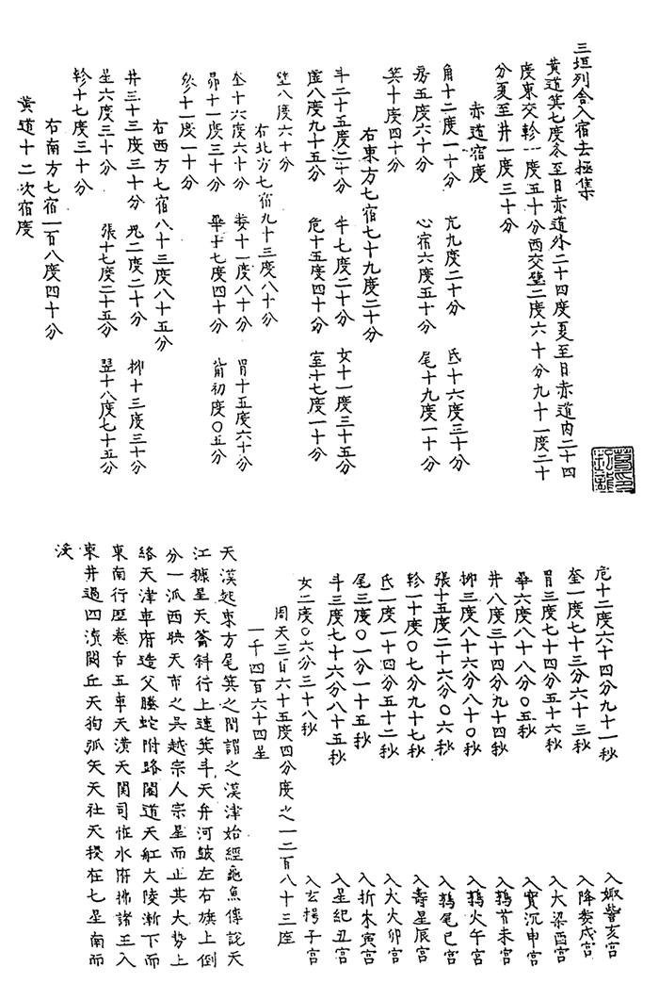
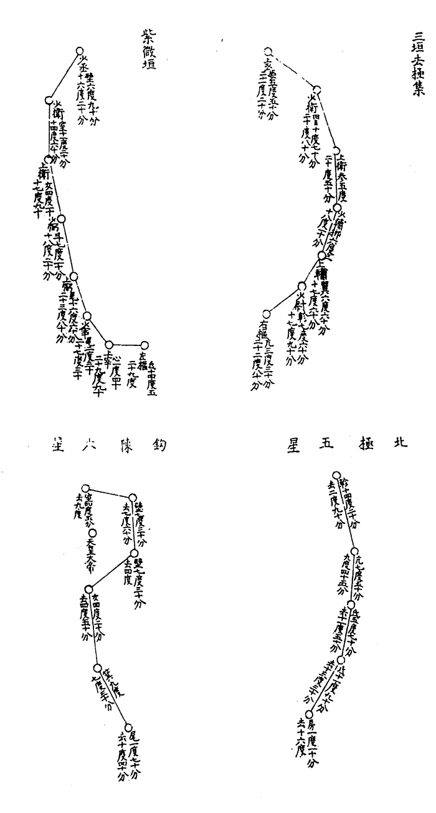

## chinese_xianglin 中国象林

本星空文化参考大量中国元代、明代的星图和观测数据，尽可能如实的呈现了中国元明时期的星象。本星空文化主要参考*三垣列舍入宿去极集*星图星表以及明末陈荩谟*象林*星图，包括了*三垣列舍入宿去极集*星图的741颗星（含星团M7、M31、M44）。以至元十七年（公元1280年）为代表年份，划分了经过二十八宿距星的赤经线。

## 星名

星名全部来源于*三垣列舍入宿去极集*中记载的741个数据，命名方法参考潘鼐*中国恒星观测史*，*三垣列舍入宿去极集*未记载的星名暂不收录。

星名后标注“?”表示存疑，标注“??”表示无对照星或缺失坐标，这里对应的现代星是按照图集猜测的，仅供参考。

若缺失坐标，除标注“??”外还会在最后标注坐标类型，“+”表示缺失赤经，“-”表示缺失赤纬。

仅4星缺失坐标，九卿中星??-、下台南星??+、羽林军第三星??+、轩辕第七星??-

误差：

▂ 1°~1°30'

▅ 1°30'~2°

▇ >2°

## 关于三垣列舍入宿去极集

### 郭守敬著作钞本的发现与考定

元初，制订《授时历》过程中，著名科学技术专家郭守敬的作为和贡献是极为突出的。据他的学生齐履谦于他身后所撰《知太史院事郭公行状》记载，新历完成后，郭守敬曾汇集整理所有资料，编篡了《历议拟稿》《修改源流》等专著十四种一百零四卷，都上呈秘藏于元廷。公元1368年，明大将军徐达率军攻入大都，元亡。当时，徐曾“封府库图籍”，后来元司天台文献大抵当与郭守敬仪器同运往南京。然而这一百零四卷专著却从此不见于任何文献著录，下落不明。明崇祯二年，徐光启以经筵讲官、礼部左待郎之职奉旨改历时，已称“元朝所有，典章散失，只存授时成法数卷，而不能言其所以然之故”。次年又报说：“郭守敬之遗书一百余卷，悉皆散佚，……”可知一代伟业，至明代几已荡然无存。

十四种专著中，有《新测二十八宿杂坐诸星入宿去极》一卷和《新测无名诸星》一卷，是郭守敬作天体测量的重要基础资料，更是具有悠久历史的中国星图和星表的一项重要发展。夜观星象，向来为中国古代学识渊博的学者和方伎术士所推崇。所以这两卷专著在民间依稀还有踪迹可寻。

清初数学家梅文鼎亦认为“郭书存亡，不可得而问”，可是他却有巧遇，曾经“收得书肆中残坏刻本，有普天星宿入宿去极度分，而中缺二宿。……”其后偶去福建，又“借钞林同人写本，始补完之”。他根据中国古代的测显单位古度“无整用百分者，百分为度，实始授时”，而这部残本“度下分有至九十余分，其为授时之法无疑”，因而悔文鼎认为这就是“并藏之宫，而书皆不传”的郭太史的《二十八舍杂坐入宿去极度分》一卷与《新测无名诸星》一卷中的恒星表。他对这书的评价很高。他评论道：“西法言普天星宿，并依黄道东行。愚尝以《唐书》证之，断其可以。独恨古无信图，而史志载距度亦只及于列宿距星，而无可广证。……今得此为证，亦足与西测恒星，互相参考矣”。但访求多年，并无所获。后终于访得北京图书馆明人钞本《三垣列舍入宿去极集》一卷。按其内容，与梅文鼎所述相仿，遂取加细考。

### 郭守敬所测二十八宿距星的宿度与去极度校算

郭守敬等人制订《授时历》，需进行大量天体测量工作。天体测量的基础资料之一是二十八宿宿度。郭守敬指出它的重要性说：“ 列宿著于天，为舍二十有八，为度三百六十五有奇。非日躔无以校其度，非列舍无以纪其度。周天之度，因二者以得之”。二十八宿宿度，历代所测不同，他曾取以比较。根据郭守敬的看法“列舍相距度数，历代所测不同，非微有动移，则前人所测或有未密” ，可以说郭守敬对此作出了前所未有的新解释。他指出产生差异的原因，可能有二。或者是前人所测不够精密，这表达出他具有后胜于前事物总是在发展的辩证思想。或者是恒星“微有动移” 。这表明他在推测恒星之间可能会有相对的运动。近代天文学测知恒星都在高速地运动着，反映在天球上，恒星有“自行” 。星球的遥远，使恒星自行值极为微小，很难察觉。但时间一久，天球上恒星间的相对位置便因而产生变化。虽然这并非宿度变化的原因，可是郭守敬能意识到恒星会微有动移，这种深邃的思维能力和独特的见解，在那个中世纪时代，真可说是不同凡响。

### 郭守敬所测恒星入宿去极度分的证认

郭守敬的两卷恒星观侧结果，继承和扩大了宋代的历次观测。它们不但是元明两代用于天象观测和天象记录的依据，并且是天文学上的重要文献。欧洲文艺复兴以前，西方可说是根本没有这样精密的星图和星表。根据钞本上郭守敬所测七百四十一星的入宿与去极度分，经过整理、归算和证认它们对应于今通用星名的哪些星，并校核其观测精度，对中国天文学史的研究，具有相当重大的学术意义和实用价值。梅文鼎昔年曾概叹过的“足以与西测恒星互相参考矣”的夙愿，也就可以实现了。

### 结语

郭守敬《新测二十八宿杂坐诸星入宿去极》图集不完全钞本的发掘和整理，使我们看到了中世纪时期天体测量一项重要成果的概貌。那一次观测包含着我国传统的一千四百六十四星以及大量尚未命名计数的星，范围是广泛的。在星座图形的星圈旁标注入宿去极度分，将星图、星表融为一体，是恒星图表表达方式的一种创新，可谓独树一帜。它的观测值具有一定的精度，并填补了北宋以后至明代相当长一段时期内的空白。对元明两代近四个世纪的天象观测和天象记录以及天文学史的研究，它都有重大的科学价值。它同时标志着我国古代的恒星图表，已可以从现存的石氏星表、宋代各星表至元代的星表，以及从敦煌星图到元、明诸星图，前后有机地贯串成一条具有连续性的链索。它们反映着中国古代星象观测较完整的面貌。欧洲和西亚，那时候还远远达不到这样高的水平。在天文学史上，郭守敬这一入宿去极图集，毫无疑问是一项较重要的科学文献，此不完全钞本基本上揭示了它的真而目。

### 三垣列舍入宿去极集下载

全书下载：

《续修四库全书》第1031册收录《三垣列舍入宿去极集》一卷

提取码: 3n8t

## 参考文献

1.潘鼐. *中国恒星观测史*. 上海:学林出版社. 2009

2.潘鼐. *郭守敬《新测二十八宿杂坐诸星入宿去极》考证*. 中国科学院上海天文台年刊. 1988

3.香港太空馆. *中国星区、星官及星名英译表*

4.*元史·历志*

## 作者

[观津邀月](https://www.zhihu.com/people/zhan-shi-ying-lu-78)
