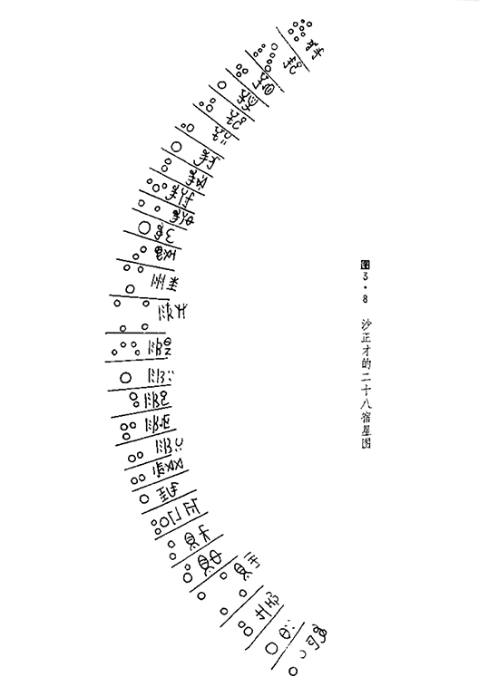
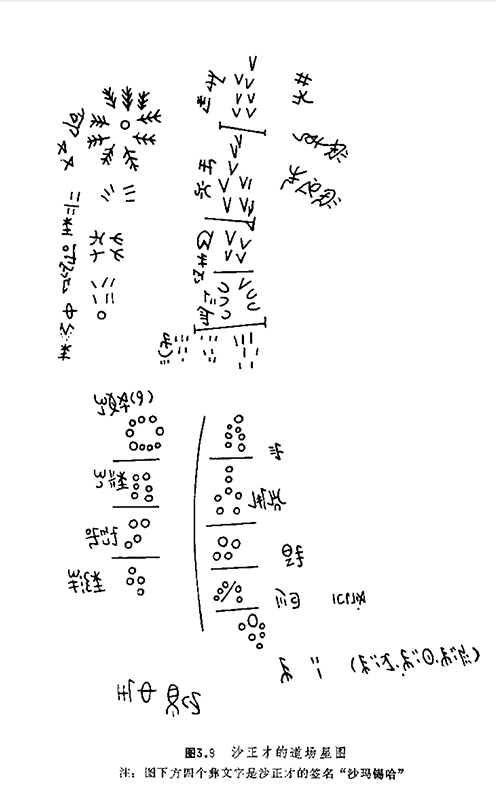

## Chinese_Yi 中国彝族

### 星表

二十八宿
|         |         |         |      |    |         |         |         |        |
|---------|---------|---------|------|----|---------|---------|---------|--------|
| 序号(沙正才) | 序号(马达仁) | 序号(陈宗祥) | 彝文音译 | 意译 | 星数(沙正才) | 星数(马达仁) | 星数(陈宗祥) | 对应中国星官 |
| 1 | 16 | 1 | 赤库(塔伯) | 岩羊群(时首) | 6 | 6 | 6 | 昴宿六亮星 |
| 2 | 17 | 2 | 赫尔局 | 中风洞 | 7 | 6 | 8 | 毕宿一至七 |
| 3 | 18 | 3 | 基瓦 | 鹦鹉头 | 3 | 3 | 3 | 觜宿 |
| 4 | 19 | 4 | 基洛 | 鹦鹉翅 | 1 | 2 | 4 | 参宿四 |
| 5 | 20 | 5 | 基觉 | 鹦鹉腰 | 3 | 3 | 3 | 井宿三、四、七 |
| 6 | 21 | 6 | 基目 | 鹦鹉尾 | 2 | 3 | 2 | 南河一、二 |
| 7 | 22 | 7 | 乌恼 | 熊胸 | 1 | 3 | 3 | 北河三 |
| 8 | 23 | 8 | 乌黑 | 胸背 | 2 | 3 | 5 | 轩辕十二、十四 |
| 9 | 24 | 9 | 乌斯督 | 公熊神 | 3 | 2 | 3 | 太微右垣四、五，五帝座一 |
| 10 | 25 | 10 | 乌斯玛 | 母熊神 | 2 | 1 | 4 | 太微左垣三、四 |
| 11 | 26 | 11 | 目塞 | 结尾 | 1 | 3 | 4 | 大角 |
| 12 | 27 | 12 | 折出 | 影子 | 2 | 4 | 6 | 亢宿 |
| 13 | 28 | 13 | 折波 | 影随 | 3 | 3 | 4 | 左摄提 |
| 14 | 1 | 14 | 日霍 | 豹头 | 4 | 4 | 4 | 氐宿 |
| 15 | 2 | 15 | 日牛 | 豹眼 | 4 | 1 | 4 | 房宿 |
| 16 | 3 | 16 | 日刻 | 豹口 | 1 | 1 | 1 | 心宿二 |
| 17 | 4 | 17 | 日觉 | 豹腰 | 2 | 3 | 4 | 尾宿一、二 |
| 18 | 5 | 18 | 日罕 | 豹心 | 3 | 3 | 1 | 尾宿三、四、五 |
| 19 | 6 | 19 | 日目 | 豹尾 | 2 | 2 | 3 | 尾宿八、九 |
| 20 | 7 | 20 | 沙巴 | 豹过完 | 2 | 2 | 4 | 箕宿 |
| 21 | 8 | 21 | 薄布 | 豪猪 | 1 | 2 | 6 | 斗宿 |
| 22 | 9 | 22 | 郎嘎 | 齐集 | 3 | 3 | 4 | 河鼓 |
| 23 | 10 | 23 | 色巴 | 公犀牛 | 2 | 2 | 3 | 虚宿 |
| 24 | 11 | 24 | 色玛 | 母犀牛 | 2 | 3 | 1 | 北落师门，羽林军八 |
| 25 | 12 | 25 | 色铁 | 大犀牛 | 4 | 3 | 4 | 室宿，壁宿 |
| 26 | 13 | 26 | 姆叶 | 彗马 | 2 | 4 | 2 | 奎宿五、九 |
| 27 | 14 | 27 | 勒克 | 兔口 | 1 | 7 | 5 | 娄宿三 |
| 28 | 15 | 28 | 塔目 | 时尾 | 2 | 2 | 3 | 天囷一、八 |
| 合计 |  |  |  |  | 71 | 78 | 104 |  |

道场
|    |      |    |    |        |
|----|------|----|----|--------|
| 序号 | 彝文音译 | 意译 | 星数 | 对应中国星官 |
| 1 | 军德古 | 集会或统帅 | 9 | 贯索 |
| 2 | 军折波 | 军师 | 6 |  |
| 3 | 纳来霍 | 助手 | 4 | 轸宿 |
| 4 | 玛子波 | 山 | 4 |  |
| 5 | 赤库 | 时首 | 6 | 昴宿六亮星 |
| 6 | 沙聂 | 驾驭八方的天神 | 7 | 北斗 |
| 7 | 牛勒 | 四方之神 | 4 |  |
| 8 | 刷太 | 路 | 5 | 天狼等(小犬座) |
| 9 | 特克 | 神兵神将 | 6 |  |
| 合计 |  |  | 51 |  |

### 星图

*沙正才的二十八宿星图*

*沙正才的道场星图*

### 外部连结
 - [*彝族天文学史*](https://pan.baidu.com/s/1l9OUTkGEhhGyuKEPN6pDGg)

密码:e6t1

### 作者

[观津邀月](https://www.zhihu.com/people/zhan-shi-ying-lu-78)基于陈久金、卢央【彝】、刘尧汉【彝】*彝族天文学史*制作了该星空文化
