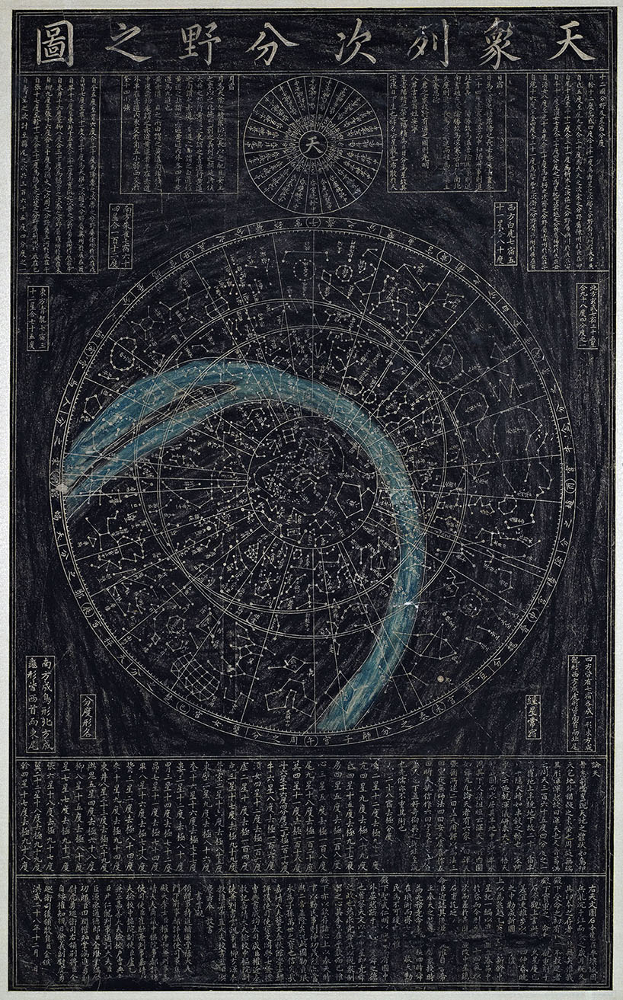

# Korean

## Introduction

《天象列次分野之图》（以下简称《天象图》）是朝鲜半岛现存的、历史最悠久且最具代表性的古代星图之一。它最初刻于公元1396年（李朝太祖三年），但其底本可追溯至统一新罗或高丽时期，甚至与中国唐代（或更早）的星图有着直接的传承关系。如今，它不仅是研究东亚古代天文学的重要实物资料，也反映了东亚各国在天文、历法、占星等领域的长期交流与融合。

## Description

*《天象列次分野之图》再刻碑拓本*

中国、朝鲜、日本的星官同源，形状看起来也很相似。星官名称最早出现于西汉《史记》中记录的约公元前100年的百余个星官。公元3世纪，星官被标准化，最终确立283个星官，1464颗星。隋唐时期，中国的天文著作传到朝鲜、日本，这一时期的代表作品是中国的《敦煌星图》、朝鲜的《天象列次分野之图》以及日本的《格子月进图》。自中国唐代以后，三国的星象开始各自独立发展，天象列次分野之图成为朝鲜星象的代表作。

### 历史沿革

据石碑最下部的跋文记载，平壤城原有一方天文图石碑，后因战乱沉入大同江，拓本也逐渐失传。李朝太祖李成桂登基之初，有人进献一本拓本，太祖视为重宝，下令书云观（负责天文观测的机构）依此本重新刻石。书云观认为原图星度已因岁差而产生偏差，建议重新测定不同季节黎明和黄昏时的南天中星，制作新图。太祖同意后，1395年年中书云观进上《中星记》一编，随后依照旧图和新测中星在石碑上镌刻成新图。石碑落款为“洪武二十八年十二月”，即公元1396年1月。

这块石碑两面都有内容相同但上下颠倒的星图和碑文。一面（A面）星图在上，标题和铭文在下，整体偏向一侧且上下错开；另一面（B面）则是典型的标题、星图、铭文布局，但图文几乎磨损殆尽。关于双面刻石的原因有多种猜测：或因石料稀缺不得不重新利用；或B面为世宗或世祖时期所刻；甚至有人认为A面更像草稿。

到了肃宗时期（1674–1720），原碑磨损严重（另一说为日本侵朝时期宫室被毁，石碑埋于废墟）。肃宗十三年（1687年）取拓本重新镌刻了一块新碑，置于昌德宫外的观象监并建屋保护。原碑被称为“初刻碑”，新碑被称为“再刻碑”。英祖46年（1770年）初刻碑在景福宫被发现，英祖命人将其移至观象监与再刻碑一同保存，并将藏碑之所命名为“钦敬阁”，御笔亲书匾额。

1910年李朝灭亡后，钦敬阁被毁，两碑被堆放在昌庆苑（后改名为昌庆苑）明政殿后屋檐下。1936年，美国人鲁弗斯（W.C. Rufus）在其著作《韩国天文学》中盛赞此图“集中体现东方星象细腻和准确”，天象碑才为世人所知。此后历经战争与动荡，直到20世纪60年代才重回公众视野，70年代被博物馆收藏。1985年初刻碑被指定为韩国国宝第228号，再刻碑被指定为宝物第837号，现均收藏于景福宫旁的国立古宫博物馆。

### 星图内容与特征

《天象图》共绘制1467颗星，与中国传统的1464星相比，有少量增减：天市垣多“宗大夫”1座（4星），文昌多1星，辇道多1星，天园多1星，器府少3星，漏刻天记1星。图中部分星名与常见写法有异，如“天枪”作“天仓”、“东瓯”作“东区”、“梗河”作“更河”、“左更/右更”作“左梗/右梗”等，应为错刻。在本星空文化中，以上错刻均已修正。

与苏州石刻天文图及绝大多数中国古代星图相比，《天象图》有三个显著特点：

1. 星点大小有差异：天狼星、老人星、大角星等亮星明显大于其他星点。
2. 星名标注有特色：很多星座名后标注了该星座的星数，但北斗七星、三垣垣墙诸星等重要恒星名称反而没有标注。
3. 星座连线与位置不同：部分星座的连线形式和相对位置与中国宋代以后的星图传统存在明显差异，这更多是由于中国在宋代及以后频繁进行天文观测，星座多次大规模变化。

### 天文结构

《天象图》属于典型的“盖图”（盖天说的星图表达方式）。图中绘有三个以北天极为圆心的同心圆：

- 内规（恒显圈）：最小的圆，圈内的恒星在观测地点一年四季永不落下。
- 天赤道：中间的圆。
- 外规（恒隐圈）：最大的圆，圈外的恒星终年无法看到。

此外，还有一个与赤道斜交成24度的圆，代表太阳视运动轨迹——黄道。从内规向外辐射出28条间距不等的放射线，对应二十八宿的宿度线，其宿度值刻在外规外围，与下方所列的石氏宿度一致。

星图外规之外的一圈文字内容为十二辰、十二国分野及黄道十二宫。星图正上方环绕“天”字书写的是二十四节气昏晓中星（即跋文所称书云观新修《中星记》所测内容）。顶部左右两侧是日宿与月宿，解释了太阳运行与寒暑变化、月行九道以及黄赤交点。八个小的补丁内写有四方各七宿的星数、宿度及星象。星图下方一栏右边为《论天》（主要摘自《晋书·天文志》，介绍浑天说及盖天说等），左边为石氏二十八宿宿度与去极度。最下方的跋文记载了碑刻由来、对太祖李成桂的赞辞，以及参与观测与制作的人员名单和立碑时间。

### 底本年代争议

《天象图》所依据的底本——平壤城原碑——究竟绘制于何时，一直是天文学史研究的重点和难点。

鲁弗斯（W.C. Rufus）认为该图为高句丽时期的古图，源自中国唐代咸亨三年（672年）的一幅星图。这一观点曾得到大多数学者认可。

中国天文史学家潘鼐从春/秋分点位置、重要恒星相对位置、黄赤道附近恒星等角度论证，认为此图必定在新罗统一朝鲜（675年）之前传入，其底本为初唐或更早所作。他指出：“论天”及十二次分野均引自《晋书·天文志》《隋书·天文志》（李淳风完成于贞观中后期，7世纪后期），因此星图的底本当不早于此时；二十八宿宿度及去极度采用的是石氏宿度（约观测于公元前100年），而非一行在开元年间（8世纪初）所测新值，因此应该不晚于一行的观测。据此推断，此图绘制于唐贞观至开元初年之间（约627–713年）。

此外，星图上“建星”在初刻碑A面刻为“立星”（B面磨损无法考证），再刻碑则改回“建星”。这种避讳现象被认为是避高丽首位国王王建之讳（朝鲜国王死后仍要避讳）。这表明底本应来自高丽时期（918–1392年）而非高句丽。因为李朝初期天文官员多沿袭前朝，若原图没有避讳，刻石时不可能出于前朝忌讳而刻意修改；但若原图已有避讳，刻石时习惯性沿用则非常自然。

综合上述证据，一个合理的推测是：李成桂所获得的天文图并非拓本，而是一幅高丽时期的摹本。摹绘时出于避讳将原图上的“建星”改为“立星”，太祖刻碑时书云观依摹本刻为“立星”，直到再刻碑时才改回“建星”。尽管如此，星图的星象内容和宿度数据仍保留了初唐至开元初年的特征，因此其原始底本的年代很可能在8世纪早期或之前。

### 星图的历元

关于《天象图》的年代问题，目前研究呈现出相当复杂的图景。该图的底本很可能来自中国唐代，但其数据来源可能更早；从星官形状来看，图中大部分星座确实反映了中国7世纪以前早期星座的形态。

然而，依据数学方法的计算（김동국, 2020）却显示，星图中不同部分的年代并不相同，大致可按纬度分为三组：北天极附近极距小于30°的区域，年代约为公元1270年；极距在45°至105°之间的第二组，年代约为公元240年；而极距大于105°的第三组，计算得出的年代竟早至公元前500年左右。第三组的数值明显存在问题——中国星座至汉代才全部形成，最早的全天恒星观测数据即石氏星表也不过成于公元前100年前后，这部分星图不太可能在公元前500年就已出现。此外，据历史记载，该星图于1395年重刻时曾进行过观测，但计算年代却完全没有到达14世纪，这也令人费解。

从数据对应关系来看，《天象图》的宿度使用了石氏宿度，这出自公元前100年左右的石氏星表，图中其他星座与石氏星表的数据也确实呈现出较好的对应关系，然而反例同样存在。除了数据上的不一致，图中还有一些星官与中国传统画法存在差异，比如天囷、七公等。骑官和羽林军两星官，在中国传统记载中被描述为“三三相连”，但《天象图》却将全部星连成一体，而非拆分为三颗一组。这些细节或许反映出星图在唐代以后、14世纪重刻以前还经历过变动。

重新审视三组数据，可以发现更多层次的问题。第一组北天极附近的恒星，明显反映出中国早期（7世纪以前）的星座形状，但整体有明显扩大。星图中将HIP 62572置于北极点，而这颗星在9世纪时最接近北天极，说明这一组星在7至14世纪期间明显经历过调整，而且调整的方法也许只是简单的平移和放大，以便将新的北极星HIP 62572置于北极点。对于第二组星，计算数据表明这部分可能诞生于公元3世纪，这期间中国吴国太史令陈卓汇总了三家星表（包括石氏星表），统一了283个星座。至于第三组星，其历元计算结果明显有误，很可能是由于它们过于靠近星表外围，导致绘制误差很大，形变严重，因此使用数学方法得出的结论并不可信。

综上可以明显看出，《天象图》的年代构成非常复杂，其最初的来源可以追溯到公元前100年左右的石氏星表以及3世纪陈卓的定纪，但又有明显的后世修改痕迹。星图不同区域的年代明显不同，说明它经历过拆分再合并的过程。尽管可以分为三组，但从星座间的相对位置（例如氐宿（Jeo）附近的明显偏移）可以看出，其很可能经历过更多的拆分。拆分后再合并的方法很可能并不科学，导致星图不同区域出现了不同程度的平移、旋转或缩放。在未考虑这些因素、未对数据进行预处理的情况下，直接使用数学方法计算《天象图》的年代，得出的结果可能会有很大误差。

### 证认过程中发现的细节

证认过程中发现一些小细节，虽然都是孤证不足为据，但仍可作为今后研究的参考。

例如傅说（G Sco）和鱼（M7）这两颗星，它们极距大于105°，属于第三组。在《天象图》与石氏星表中，傅说均位于鱼以北，这明显不符合两星实际的相对位置。这种在错误数据上的一致性，似乎可以反映出《天象图》与石氏星表存在直接的数据传承关系。

与之相对，《天象图》与石氏星表不符的例子也有：大陵和天船两星官（属于第二组），在石氏星表中天船北星为η Per，大陵北星为k Per，明显与《天象图》不符；相反，中国古代记录中唯一与《天象图》符合的却是北宋的景祐星表（公元1034年）。

再如高自行恒星引起的星座形状变化，王良星官的η Cas和咸池星官的λ Aur，它们在《天象图》上的相对位置更符合较晚的年代而非早期年代；而九州殊口的ο2 Eri，却反映出早期的形状，尽管其证认本身值得怀疑。

当然也有学者认为，依据这样少量的细节不足以得出结论，因为星图本身的绘制并不精确。

### 星图的证认

与年代的考证相似，《天象图》的证认虽然已有不少研究，但很难形成统一结论。

如前所述，该图很可能经历过拆分后重新合并的过程，这使证认工作变得十分困难：我们必须精准判断哪些星座应归属于同一区块，因为不同区块之间的星座位置往往存在较大偏移。《天象图》中的星座与中国早期星座高度一致，这意味着证认者必须对早期中国星官非常熟悉；同时，由于星图从唐代至14世纪可能经历过多次修改，证认时还需考虑中国星官在历史上的变迁，才能判断哪些星官在后世可能出现过修改，从而得出正确的证认结论。后世的修改可能导致了更严重的后果——如果当时修改时没有仔细考证，修改后的星座可能会与其他星座发生重叠；若此类情况较多，证认将变得异常困难。

本研究的证认结果基本反映了《天象图》的原貌。在证认过程中，我们充分考虑了历史上的星座变迁。在遇到形状与亮度的选择时，优先采用星图中的形状与位置，即使这意味着要使用一些更暗的恒星。在极端情况下，不得不使用6.5等以下的恒星——这大概是星图不标准所导致，并非真的应该选取如此暗的星。另外，证认时我们不会直接假设星座之间存在重叠，但当实在无法解释时，也只能展现出重叠的结果（例如骑官、九斿）。

## References

 - [#1]: [维基百科 - 天象列次分野之图](https://zh.wikipedia.org/wiki/%E5%A4%A9%E8%B1%A1%E5%88%97%E6%AC%A1%E5%88%86%E9%87%8E%E4%B9%8B%E5%9B%BE)
 - [#2]: 김동국 (金东国). (2020). 천상열차분야지도에 실린 별들의 동정 및 분석 (《天象列次分野之图中所载恒星的证认与分析》). 首尔大学研究生院物理·天文学部天文学专业硕士学位论文
 - [#3]: [Namuwiki - 天象列次分野之图](https://en.namu.wiki/w/%EC%B2%9C%EC%83%81%EC%97%B4%EC%B0%A8%EB%B6%84%EC%95%BC%EC%A7%80%EB%8F%84)
 - [#4]: 宫岛一彦. (2014). 朝鮮・天象列次分野之図の諸问题 (《朝鲜〈天象列次分野之图〉的若干问题》). 大阪市立科学馆研究报告, 24, 57-64.
 - [#5]: 竹迫忍. (2019). [『天象列次分野之図』の碑文と星図の関係について（《关于〈天象列次分野之图〉碑文与星图的关系》）](https://www.kotenmon.com/str/gesshinzu/tensyouzu.html).
 - [#6]: 潘鼐. (2009). 中国恒星观测史. 上海: 学林出版社. ISBN 9787807306948.
 - [#7]: [《天象列次分野之图》的一种证认方案](http://afnmp3.homeip.net/~kohyc/calendar/skymap.html) (A Proposed Identification of the Cheonsang Yeolcha Bunyajido)
 - [#8]: [国立古宫博物馆](https://www.gogung.go.kr/gogungCn/main/main.do)

## Authors

This sky culture was contributed by Stellarium user *[Jeong, Tae-Min](http://user.chollian.net/~jtm71/)*

本星空文化由Stellarium用户 *[Jeong, Tae-Min](http://user.chollian.net/~jtm71/)* 贡献。

吕昊程 [lvhc2016@126.com](lvhc2016@126.com) 对星图进行了重新证认，并完善了说明。

证认的过程非常困难，而且结果并不是唯一的，如果您对证认结果或其他内容有任何疑问，即使是非常小的细节，也欢迎您联系我。[lvhc2016@126.com](lvhc2016@126.com)

## License

GNU GPL v2.0
